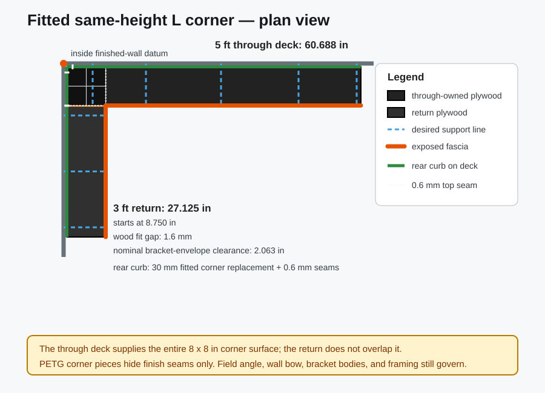
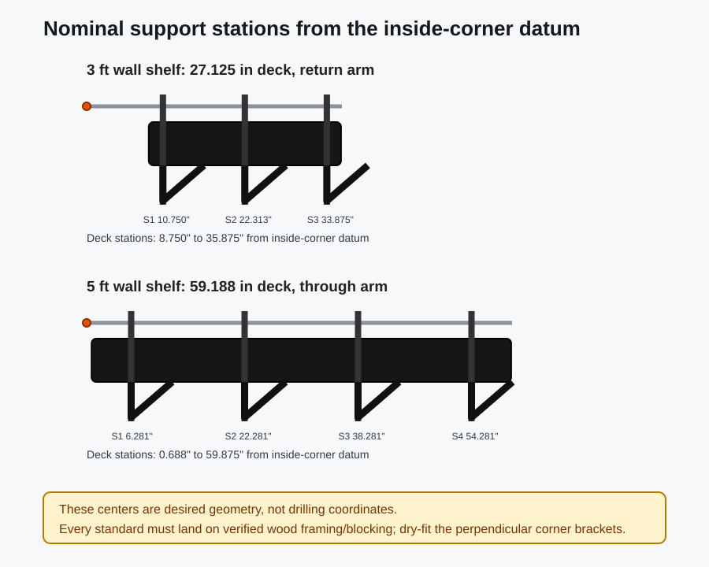
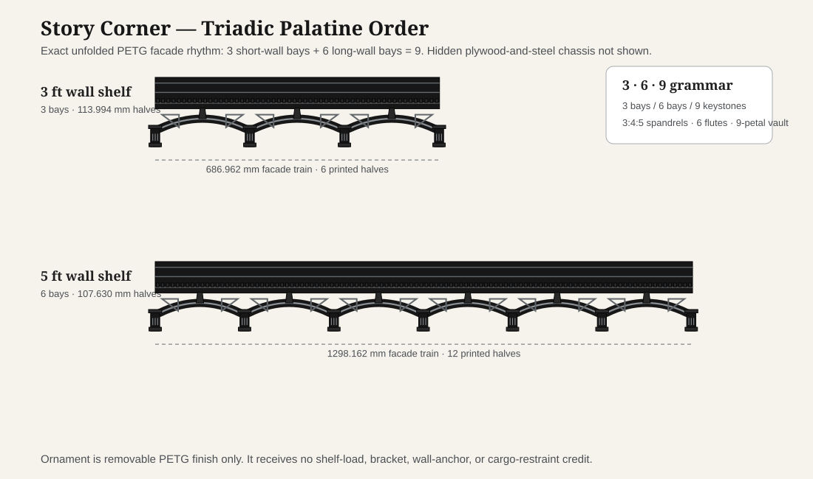

# Engineering design basis — Triadic Palatine fitted-L prototype

This document records R12 final-durable design intent, parametric geometry, and verification requirements. It is not a stamped calculation, code approval, installation certification, or tested load rating.

The measured 61.5 in long wall uses five planned support lines at 6.0, 17.0, 32.5, 48.5, and 60.5 in from the inside corner. The middle three are measured studs; the two end lines require purpose-installed structural blocking before mounting. The nominal 36 in return is on hold pending field measurements.

## 1. Design problem and load-path split

Story Corner is one same-height L shelf whose visible surface reaches the exposed ends of a nominal 36 in return and measured 61.5 in long wall. The selected development depth is 8 in. SUNLU clear PETG creates the Triadic Palatine finish; long-term storage load remains outside creep-sensitive printed plastic.

The jobs are deliberately separate:

1. Verified wood framing or purpose-installed blocking and structural fasteners transfer load into the wall.
2. Locked steel brackets resist the shelf cantilever moment.
3. A continuous plywood deck and continuous front steel angle within each arm distribute stored load.
4. PETG provides replaceable top finish, modest item retention, fitted seams, and architectural ornament.

The 5 ft arm runs through and owns the corner. The shortened 3 ft return starts beyond the through deck's front plane. Both decks retain independent supports. The plywood joint, optional alignment plates, PETG fascia, arches, piers, and vault receive no capacity credit.

An all-PETG structural shelf is not an alternate configuration of this design. Roman arches develop compression reactions between abutments; they do not eliminate tension at a cantilevered wall connection, printed layer anisotropy, joint behavior, or PETG creep. Any all-printed structural concept would be a separately scoped, tested, light-duty project and could not inherit R12's selection targets.

## 2. Two-wall corner coordinate model

The coordinate datum is the intersection of the two finished wall planes. Positive long-wall and short-wall stations run outward from that datum.

Define:

- `WL = 60 in`: nominal long-wall clear length;
- `WS = 36 in`: nominal short-wall clear length;
- `bL`: installed shelf-back offset on the long/through wall;
- `bS`: installed shelf-back offset on the short/return wall;
- `D = 8.000 in = 203.2 mm`: selected deck depth, pending confirmation;
- `j = 1.6 mm = 0.062992 in`: concealed plywood fit gap;
- `c = 0.125 in`: nominal exposed-end clearance.

The offsets are measured independently. Catalog projection does not include differences caused by drywall mud, wall bow, shims, or fastener seating. When a field value is absent, each wall currently falls back to the 0.6875 in reference standard projection.

The corner formulas are:

- through-deck start on the long-wall axis: `bS`;
- through-deck end: `WL − c`;
- through-deck length: `WL − c − bS`;
- through-owned corner bounds: long axis `bS..bS + D`, short axis `bL..bL + D`;
- return-deck start on the short-wall axis: `bL + D + j`;
- return-deck end: `WS − c`;
- return-deck length: `WS − c − bL − D − j`.

At the current equal nominal offsets:

- through deck: stations 0.6875–59.875 in; length 59.1875 in;
- return deck: stations 8.750492–35.875 in; length 27.124508 in;
- plywood footprint overlap: 0;
- concealed gap: 1.6 mm.

The structural front angle stays continuous within each arm. The return angle is field-trimmed and deburred to clear the through angle; contact between them is not a splice.

The shelf tops must be set from one laser datum. Matching bracket slot numbers do not establish coplanarity if the two standard arrays start at different elevations.



## 3. Near-square angle and residual-gap derivation

Let `delta = |measured angle − 90°|`. The approximate edge shift across the 203.2 mm deck depth is:

`shift = 203.2 × tan(delta)`

The remaining nominal joint clearance is:

`residual = 1.6 − shift`

The gap-only physical overlap limit is:

`atan(1.6 / 203.2) = 0.451139°`

The stricter limit that preserves the required 0.6 mm residual is:

`atan((1.6 − 0.6) / 203.2) = 0.281965°`

The configured square-footprint gate is ±0.25°. At that limit, nominal shift is approximately 0.887 mm and residual clearance is approximately 0.713 mm. The generator rejects:

- a nonpositive or impossible residual policy;
- a configured gate above the residual-derived 0.281965° limit;
- a verified angle beyond ±0.25°;
- a verified angle leaving less than 0.6 mm nominal residual clearance.

This calculation addresses only ideal straight edges. A full-size template remains required for wall bow, mud, caulk, surface damage, and the actual cut line. Exceeding the gate requires revised deck and corner footprints, not slicer scaling of cosmetic parts.

## 4. Support placement and interference

### 5 ft through arm

- Deck stations: 0.6875–59.875 in from the corner datum.
- Four desired support lines: 6.28125, 22.28125, 38.28125, and 54.28125 in.
- Support intervals: 16 in.
- End overhangs: 5.59375 in.

### 3 ft return arm

- Deck stations: 8.750492–35.875 in from the corner datum.
- Three desired support lines: 10.750492, 22.312746, and 33.875 in.
- Support intervals: approximately 11.562254 in.
- End overhangs: 2 in.

These are desired geometry, not drilling coordinates. Every line must land on verified wood framing or purpose-installed structural blocking. Field centers must be finite, distinct by at least the current 2 in independent-support development guard, within their deck, no more than 16 in apart, and leave no more than 6 in end overhang.

Using the 7.26 in reference bracket reach and nominal offsets, perpendicular bracket-body clearance is approximately 2.803 in. Using the more conservative entire 8 in shelf envelope, clearance is approximately 2.063 in. Both exceed the 1 in development minimum, but neither captures actual bracket width, locks, screws, manufacturing tolerance, wall angle, or installation error. Physical two-bracket dry fit is mandatory.

The 42 mm Palatine groin-vault soffit occupies stations 7.010–8.664 in beneath the through-owned corner square. Its nominal distance from the nearest through support plane at 6.281 in is 18.519 mm. Regeneration stops below the 10 mm development minimum, and the real bracket body still requires a dry fit.



## 5. Wall hardware, plywood, and steel

The reference basis is KV 82/182 or an equivalently documented complete system:

- 39 in black double-slot steel standards;
- 7 in black brackets intended for 8 in shelves;
- approximately 1.25 in vertical adjustment increments;
- a bracket lock at every station;
- mechanical deck attachment at every bracket;
- manufacturer-prescribed compatible fasteners, holes, spacing, and installation.

Do not combine a capacity result from one product family with components or installation details from another.

The user-reported distance from outlet top to ceiling is 43.5 in. A nominal 39 in standard leaves only 4.5 in total placement margin. Remeasure the zone, locate wiring and protective plates, and establish the common shelf-top datum before drilling.

Use 23/32 in cabinet-grade veneer-core plywood with the long arm parallel to the face grain. MDF, particleboard, sheathing-grade, damaged, or warped stock is not an equivalent substitution. Cut both arms from the same panel where practical to reduce thickness mismatch.

Each arm uses a continuous 1 x 1 x 1/8 in steel angle under its front edge. Predrill with reviewed edge distances and fasteners that cannot break through the deck top. Optional field-fitted slotted steel alignment plates may assist coplanarity after bracket dry fit, but they do not replace either arm's nearest bracket and receive no load-rating credit.

## 6. PETG top and rear-curb architecture

All printable components are PETG-only and nonstructural. Saved orientations fit the declared 180 x 180 x 180 mm minimum model envelope.

The 8 in top is divided into two 101.3 mm rows with a 0.6 mm seam. The length system uses a 152.4 mm pitch:

- universal center: 151.8 mm;
- shared top ends: 116.081 mm;
- all top-tile plan radii: 0.25 mm, which remains no greater than half the 0.6 mm seam;
- four 101.3 x 101.3 mm quadrants cover the through-owned corner square;
- both straight top arms start 0.6 mm beyond the through corner front line;
- the return inner tile overhangs the hidden plywood gap by 1.0 mm without structural credit.

The rear-curb system is split so no PETG curb crosses the plywood joint:

- a fitted L replaces the first 30 mm on both wall directions;
- the long-wall straight curb begins at station 1.892 in;
- a separate 172.6 mm short-wall piece stays on the through-owned corner square and stops at station 8.6875 in;
- the return straight curb begins on its own board at station 8.750492 in;
- nominal through ends: 126.481 mm; nominal return ends: 115.581 mm;
- center counts: 8 through and 3 return.

Installed vertical stack:

```text
deck top datum             z = 0
top tile                   z = 0–2.0 mm
rear-curb base             z = 2.4–5.6 mm
rear-curb upright top      z = 17.4 mm
```

The 17.4 mm upright top is the 15.0 mm printed curb height (`rear_curb_height_mm` in config.json) sitting on the 2.4 mm tile; edit the config value, not the sum.

Each straight curb piece has one 8 x 4.4 mm generated clearance slot. The L replacement has one slot per arm. Field-drill the matching tile only after layout; then use a short nonstructural pan-head screw into plywood with verified underside clearance. Never clamp PETG rigidly, bridge a printed seam, or cross the wood joint.

## 7. Triadic Palatine fascia architecture

The R12 ornament is a replaceable skin with zero structural credit. Primary fascia faces/flanges are 3.2 mm, arch webs 3.6 mm, rear curbs 3.2 mm, top tiles 2.4 mm, and non-mating plate corners use a 1.5 mm radius with 2.0 mm channel-root reinforcement:

- 3 complete segmental bays on the return and 6 on the through arm;
- 6 short-arm and 12 long-arm handed half-arches;
- half widths: 113.99375 mm return and 107.630208 mm through;
- 0.6 mm seams between all 18 halves;
- functional fascia height: 76.05625 mm;
- arch drop: 92 mm;
- total saved height: 170.05625 mm;
- segmental rise: 48 mm with 6 mm overlap into the fascia;
- panel thickness: 3.2 mm;
- 5 mm outer archivolt, 2.4 mm true shadow slot, and 4 mm inner archivolt;
- 22 mm shared pier with three 1 mm flutes per half, resolving six across an assembled pier, a 9 mm-high / 4 mm-projecting base, and an 8 mm-high / 5 mm-projecting capital;
- one 3:4:5 spandrel void per half;
- a holeless full-depth upper/lower channel around the real plywood, tile, and continuous-angle stack.

Each half receives its own removable 24 mm-high entablature overlay: 2.0 mm base, 1.2 mm relief, 9 dentils, 3 triglyph groups, 3 continuous orders, and an 11 mm central patera. The overlay attaches only to its host half.

Nine 18 x 24 x 3.0 mm keystones hide bay-center seams. Each is retained to one half only and floats across the other. The 18 mm-leg, 170.056 mm-high corner pilaster follows the same rule: fix one upper leg and float the perpendicular leg.

Two compound 170.056 mm-high endcaps close the exposed arcade/fascia ends. Each straight fascia layout already reserves the 3.0 mm cap thickness.

The 42 x 42 x 3.0 mm groin-vault soffit (2.0 mm base plus 1.0 mm relief) has diagonal ribs, border, and a nine-petal boss. Its two slots mount it only beneath the through-owned corner square; it must not bridge the return joint.

The fascia upper flange overlays the top tile. Its nominal channel opening is:

`18.256 mm plywood + 25.4 mm angle leg + 2.4 mm tile + 0.6 mm clearance = 46.656 mm`

The coupon must be tested against that complete physical stack. Arcade shapes that resemble brackets or piers remain decoration only.



The elevation drawing documents module geometry and ornament only; support locations and structural dimensions remain governed by the corner and support plans.

## 8. Removable attachment policy

Attachment controls trim movement and falling; it does not carry shelf contents or create a rated restraint.

- **Top tiles:** one small centered dot of qualified removable neutral-cure silicone on sealed plywood; keep edges and seams free and remove with floss.
- **Rear curbs:** one slotted short pan-head screw per straight piece and one per replacement arm after tile drilling and underside-clearance check.
- **Arcade/fascia halves:** the full-depth upper and lower flanges mechanically capture the real shelf stack. Assemble the lateral train before the outer endcaps and re-entrant corner cover, then use one tiny centered dot of qualified removable neutral-cure silicone inside each channel only to resist creep and rattle. Do not drill or notch the continuous steel angle for cosmetic retention.
- **Entablatures:** one tiny centered qualified removable silicone dot on the overlay's own fascia half; no overlay bridges a 0.6 mm seam.
- **Keystones:** two pinhead-size qualified removable silicone dots on one arch half; the other side floats across the 0.6 mm center seam.
- **Corner pilaster:** two tiny qualified removable silicone dots inside one upper leg; the perpendicular leg floats and adhesive does not cross the seam.
- **Endcaps:** two tiny qualified removable silicone dots inside the completed channel plus a hand pull-check.
- **Groin vault:** two generated clearance slots and short nonstructural pan-head screws into the underside of the through-owned plywood after a depth-stop and bracket-clearance check; never bridge the plywood joint.

Every adhesive and fastener must be qualified on printed PETG, sealed plywood, and the actual coated steel. Keep all structural fasteners, locks, alignment plates, and the wood joint inspectable.

## 9. Package, modularity, and reconfiguration

The R12 full print set contains 102 objects: 98 installed pieces plus the adhesion-corner coupon, corner gauge, fascia coupon, and Palatine detail coupon. Geometry-volume estimates are 3.12 kg packaged and 3.06 kg installed PETG. These exclude purge, supports, failures, spares, attachment hardware, plywood, and steel.

Allowed customization is constrained:

1. **Vertical movement:** unload the complete L and move both arms to one verified common elevation.
2. **Wall-fit changes:** enter both limiting wall lengths, both installed back offsets, the corner angle, and verified support centers; regenerate all affected geometry and plans.
3. **Finish reuse:** universal 151.8 mm top/rear centers may move between arms where counts permit. Ends, Palatine halves, curbs, and corner pieces are regenerated when their controlling geometry changes.

The plywood and front angles do not use printed snap joints. Moving one arm alone, moving a standard horizontally, changing depth, changing through/return ownership, changing the 3/6-bay order, or adding a shelf level requires another geometry, framing, electrical, collision, attachment, and cumulative-load review.

## 10. Selection targets—not ratings

The deliberately limited plywood-span check uses a **30 lb/ft total development line-load proxy**. That proxy sits above the approximately 24.3 lb/ft contents-selection density to leave a rough allowance for unmeasured shelf dead load; it is not measured demand, a safety factor, or a rating. When a run's `field_verified_shelf_arm_dead_load_lb` is entered, the check's governing line load becomes the larger of the proxy and that arm's contents target plus measured dead weight over its deck length; `generated/structural_sanity_check.json` reports the governing value and its source. A measured value can only raise the check, never relax it, and still creates no rating.

Current round-number contents-selection targets are:

- 55 lb evenly distributed on the 27.125 in return deck;
- 120 lb evenly distributed on the 59.188 in through deck, including the corner square.

The calculation excludes wall and stud capacity; standards, brackets, locks, and fasteners; cumulative shelf levels; point, impact, front-edge, seismic, and accidental loads; plywood variability; connection slip; and corner differential movement. The selection targets cannot be inferred from or multiplied by a bracket laboratory result.

Keep dense items close to and between brackets, avoid concentrated front-edge loads, and put the heaviest storage on the lowest suitable shelf. Do not store people, fragile liquid containers, or unusually dense objects overhead.

## 11. Failure controls

| Failure mode | Required control |
|---|---|
| Two full-depth boards overlap | Through/return formulas and zero-overlap validation |
| Unequal wall offsets are hidden | Measure and enter `field_verified_installed_shelf_back_offset_in` independently for both runs |
| Non-square edges consume the joint | ±0.25° gate, 0.6 mm residual rule, and full-size template |
| Perpendicular brackets collide | Numerical envelope checks plus mandatory physical dry fit |
| Return seam hangs unsupported | First return bracket 2 in from its structural end; no joint capacity credit |
| Angle ends collide | Continuous per-arm angles, return trim/deburring, and controlled clearance |
| PETG architecture is mistaken for structure | Explicit zero credit; hidden plywood/steel load path remains mandatory |
| Groin vault hits a bracket or bridges decks | Through-only footprint, 10 mm generated clearance minimum, field dry fit |
| Corner finish binds | 0.6 mm seams; keystone and pilaster fixed on one side and floating on the other |
| Rear curb crosses the wood joint | Separate through-zone and return pieces with arm-specific starts |
| Curb base overlaps the top tile | Explicit installed z stack and matching tile fastener clearance |
| Finish falls or creeps | Captured fascia channels, qualified removable attachment, curb/soffit clearance slots, hand pull-check, inspection |
| Deck surfaces form a ridge | Same panel stock, laser common datum, unloaded bare-structure dry fit |
| One arm moves independently | Treat each L level as one unloaded coupled assembly |
| Wall attachment fails | Verified framing/blocking, compatible complete hardware system, no primary hollow-wall anchors |
| Electrical route is struck | Wiring/plate verification before selecting or drilling standard lines |

## 12. Controlled verification and service

1. Install standards and brackets, then dry-fit both bare plywood/steel arms without PETG.
2. Confirm every standard is plumb, each top is coplanar, every lock is engaged, every deck is mechanically attached, and perpendicular brackets/angles do not touch unexpectedly.
3. Record unloaded front-edge position at the center and ends of both arms using a fixed reference.
4. Apply known, nonfragile weights gradually and evenly while keeping people clear.
5. Stop for fastener motion, wall crushing, sound, distortion, cracking, whitening, ridge formation, or unexpected deflection.
6. Hold only the intended selection target—never a guessed overload—and re-inspect on the schedule in [SAFETY.md](SAFETY.md) "Before loading": after one hour, 24 hours, one week, one month, after every move, and at least annually.
7. Unload and record residual movement.
8. Install qualified PETG attachment and finish only after the bare structure remains stable; hand-check every hanging Palatine component and repeat visual inspection.

This process can reveal obvious defects but cannot certify a safe-working load. Obtain qualified local review whenever failure could injure someone or the wall construction, fasteners, steel drilling, or cumulative loading remain uncertain.

Follow the single inspection schedule above (SAFETY.md "Before loading"). Unload for loose screws, failed adhesive, corrosion, wall movement, permanent deflection, damaged plywood, binding trim, loose ornament, or cracked/warped PETG. Record exact hardware, measurements, stud locations, test weights, installation date, attachment products, and every later configuration change.
