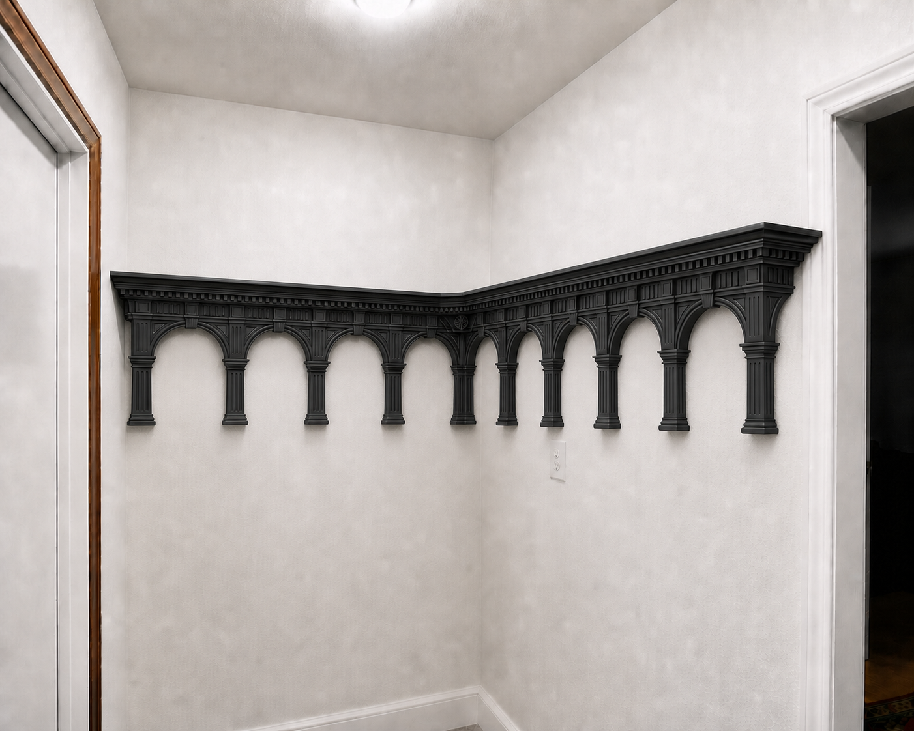
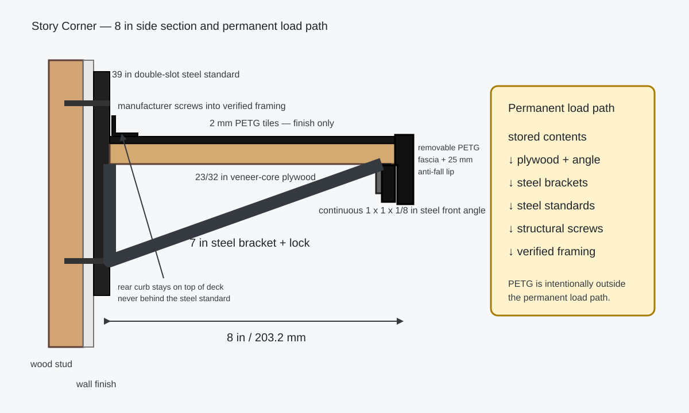

# Story Corner

## Want a shelf this week?

**→ [PRINT_THE_SHELF.md](PRINT_THE_SHELF.md)** — An all-PETG structural shelf for the long wall (61.5 in). No plywood, no steel angle. Print the parts, screw brackets into the three verified studs (17.0, 32.5, 48.5 in), and have a working shelf for light storage.

The Triadic Palatine decorative skin below is **optional and can be added later** (or never). The structural all-PETG shelf works on its own.

---

**Triadic Palatine Order — a parametric PETG-finished hybrid closet shelf**

Story Corner is a same-height L shelf for nominal 3 ft and 5 ft closet walls. The r5 **Triadic Palatine Order** gives the visible black PETG skin a palace-like 3–6–9 composition: three arcade bays on the short arm, six on the long arm, nine keystones, fluted shared piers, stepped entablatures, dentils, a fitted corner pilaster, and a groin-vault corner soffit. The original hybrid design used continuous plywood and steel as the load path, with PETG as finish only.

> **Prototype status:** the meshes and model-only 3MF packages are generated design-development artifacts. The wall lengths, separate installed offset on each wall, corner angle, wall bow, framing map, hardware envelope, 8 in depth, attachment stack, printer, nozzle, build plate, PETG product, and completed assembly remain unverified. No tested load rating is claimed. No embedded G-code is included.



The rendering shows visual intent only. It is not a measurement drawing, hardware layout, proof of fit, or load test. Construction is governed by the field measurements, [corner plan](generated/corner_layout.svg), [support plan](generated/support_layout.svg), and [safety boundary](SAFETY.md).

## Design snapshot

Viewed from the closet opening, the nominal plan places the 5 ft through arm on the right wall and the 3 ft return on the back wall; this handedness still requires field confirmation. The through deck owns the 8 x 8 in corner square. The return starts beyond the through deck's front plane, so the boards do not overlap and both arms retain independent bracket support.

| Arm | Nominal plywood stations from inside corner | Nominal deck | Desired support centers from inside corner | Palatine arcade |
|---|---:|---:|---|---:|
| 5 ft through | 0.688–59.875 in | 59.188 x 8 in | 6.281, 22.281, 38.281, 54.281 in | 6 bays / 12 halves |
| 3 ft return | 8.750–35.875 in | 27.125 x 8 in | 10.750, 22.313, 33.875 in | 3 bays / 6 halves |

The shortened return still completes the full short-wall surface because the through deck supplies the corner. Nominal geometry uses 0.6875 in as the provisional installed shelf-back offset on **each** wall, an 8 in deck, a 1.6 mm concealed plywood fit gap, and 1/8 in clearance at each exposed outer end. These are not field cut dimensions.


The desired support layout limits longitudinal spacing to 16 in and end overhang to the configured 6 in maximum; the nominal plan works out to 5.594 in on the through arm and 2 in on the return. It is not a drilling map. Every standard must land on verified wood framing or purpose-installed structural blocking. Dry-fit the two nearest perpendicular brackets, locks, fasteners, and both steel angles together before drilling.

## Permanent load path

Every generated printable component is PETG-only and intentionally nonstructural:

`contents -> each continuous plywood deck / its continuous steel front angle -> independent steel brackets -> steel standards -> structural fasteners -> verified framing or blocking`

The printed arches, piers, keystones, entablatures, top tiles, curbs, corner pieces, and fascia can conceal the chassis, but they do not become that chassis. Roman arch geometry does not solve the tension and long-term creep demands of a wall-mounted cantilever. An all-PETG structural shelf or printed wall bracket is outside this project and cannot inherit its selection targets, support plan, or safety language.



## Two-wall corner model

The coordinate datum is the intersection of the two finished wall planes. Measure the installed wall-to-plywood-back offset independently on both walls:

- `b5`: offset on the long/through wall;
- `b3`: offset on the short/return wall;
- `D`: shelf depth;
- `j`: plywood fit gap.

The through deck starts at `b3` along the long-wall axis. The return deck starts at `b5 + D + j` along the short-wall axis. The through-owned corner zone spans `b3` to `b3 + D` on the long-wall axis and `b5` to `b5 + D` on the short-wall axis. Equal catalog standard projections do not prove that the installed offsets are equal after wall bow, drywall mud, shims, and fastener seating.

The current nominal values happen to give the same stations shown in the table because both unverified offsets fall back to 0.6875 in.

## Near-square angle and residual-gap rule

The square deck footprints use a deliberately narrow field-angle gate:

- nominal plywood gap: 1.6 mm;
- required residual nominal clearance: at least 0.6 mm;
- configured maximum verified deviation from 90°: ±0.25°;
- gap-only physical overlap limit across 203.2 mm depth: approximately ±0.451°;
- residual-clearance-derived limit: approximately ±0.282°.

Angular edge shift is `203.2 mm × tan(|angle − 90°|)`. At ±0.25°, the nominal shift is about 0.887 mm and the remaining nominal joint clearance is about 0.713 mm. Generation must stop if the configured gate exceeds the residual-derived limit, a verified angle exceeds ±0.25°, or the remaining clearance is below 0.6 mm. A full-size template is still mandatory because this trigonometric check does not include wall bow, caulk, or drywall buildup.

## Triadic Palatine Order

The ornament follows a controlled 3–6–9 grammar rather than adding unrelated decoration:

- 3 segmental-arch bays on the short arm and 6 on the long arm;
- 18 handed arcade/fascia halves separated by 0.6 mm seams and finished by 9 floating keystones;
- 113.994 mm short-arm halves and 107.630 mm long-arm halves;
- 92 mm arch drop, 48 mm rise, 6 mm overlap into the functional fascia, and 168.056 mm total saved height;
- a 5 mm outer archivolt order, 2.4 mm true shadow reveal, and 4 mm inner order;
- a 22 mm shared pier with three 1 mm flutes per half — six across the assembled pier — plus 9 mm-high / 4 mm-projecting bases and 8 mm-high / 5 mm-projecting capitals;
- one 3:4:5 spandrel void per half;
- removable 24 mm-high entablature overlays, each with 9 dentils, 3 triglyph groups, 3 cornice orders, and an 11 mm central patera;
- an 18 x 24 x 2.4 mm keystone at every bay center, retained to one half while floating over the other;
- an 18 mm-leg full-height re-entrant corner pilaster fixed on one upper leg and floating on the perpendicular leg;
- a 42 mm groin-vault soffit with diagonal ribs and a 9-petal boss, mounted only beneath the through-owned corner square.

The groin-vault footprint currently has 18.519 mm nominal clearance to the nearest through support plane, above the 10 mm development minimum. Field support locations must regenerate and re-pass that check. None of these forms receives structural credit, even when it visually resembles an arch, pier, bracket, or vault.


The elevation drawing records exact nominal stations, counts, and module dimensions; its displayed arch curves are schematic. It is not a structural elevation or a substitute for checking the 180 mm printer envelope.

## Finish fit and attachment

- All top tiles use a 0.25 mm plan radius and 0.6 mm seams. Four 101.3 mm quadrants finish the through-owned corner square. The return's inner tile floats 1.0 mm over the concealed 1.6 mm plywood gap without receiving load-path credit.
- The fascia channel opening is nominally 46.256 mm: 18.256 mm plywood + 25.4 mm steel-angle vertical leg + 2.0 mm top tile + 0.6 mm fitting clearance. The upper flange overlays the tile.
- Every finish piece attaches only with qualified removable products — silicone dots, captured channels, or short nonstructural screws through generated slots. The complete attachment sequence, dot counts, and installed z-stack live in [ASSEMBLY.md](ASSEMBLY.md); the attachment policy is in [ENGINEERING_DESIGN.md](ENGINEERING_DESIGN.md) section 8. Never drill or notch the continuous steel angle for cosmetic retention.

Attachment prevents loose trim, rattle, and falling only. It does not carry stored weight or turn the printed anti-fall features into rated cargo restraints.

## Split rear-curb system

The rear curb sits on the PETG tile/plywood stack — never on bare plywood and never across the structural joint. The long-wall straight curb starts at station 1.892 in after the 30 mm fitted replacement; a separate 172.6 mm corner-side curb stays on the through-owned corner square; the return curb starts on its own plywood at 8.750 in, beyond the 1.6 mm wood gap. Rear-curb ends are arm-specific: 126.481 mm through, 115.581 mm return. The installed z-stack and the slot/drill/screw procedure are in [ENGINEERING_DESIGN.md](ENGINEERING_DESIGN.md) section 6 and [ASSEMBLY.md](ASSEMBLY.md) Stage 4.

## Safe customization

- Universal top and rear-curb centers use a 152.4 mm pitch and are 151.8 mm wide with 0.6 mm seams.
- Measured arm lengths regenerate symmetric top/curb ends and the complete 3/6-bay Palatine fascia layout.
- The nominal top ends are shared at 116.081 mm. Rear-curb ends and all Palatine half widths are arm-specific.
- A same-height L level must be unloaded and moved as one coupled assembly. Moving one arm alone breaks the fitted corner.
- Moving a standard horizontally requires a new framing, wiring, bracket-interference, spacing, overhang, and groin-vault-clearance review.

The structural plywood and steel angle do not use printed snap joints. Modularity is limited to replaceable finish pieces and controlled vertical movement on the steel standards.

## Start here

1. Read [PRINT_ME_FIRST.md](PRINT_ME_FIRST.md) before opening a production file.
2. Read [SAFETY.md](SAFETY.md) before cutting, drilling, attaching trim, or loading.
3. Review [ENGINEERING_DESIGN.md](ENGINEERING_DESIGN.md) for formulas, failure modes, and verification limits.
4. Fill in [MEASUREMENT_WORKSHEET.md](MEASUREMENT_WORKSHEET.md), transcribe its section H into [config.json](config.json), then rebuild every generated artifact and verify the `*_source` fields per worksheet section I.
5. Follow [ASSEMBLY.md](ASSEMBLY.md) for the build sequence, from structural install through load acceptance and service.
6. Open [the full model-only print set](generated/model_only_3mf/MODEL_ONLY_STORY_CORNER_TRIADIC_PALATINE_FULL_PRINT_SET.3mf) only after confirming the printer, nozzle, plate, PETG product, and attachment coupons.

The full 3MF contains **101 exact-quantity catalog objects**: 98 installed finish pieces plus three print-first test objects. It is not arranged into real printer plates and contains no machine instructions. The nominal geometry estimate is **2.45 kg packaged PETG** and **2.42 kg installed PETG**, excluding purge, supports, failures, spares, fasteners, plywood, and steel.

## Field information still required

Before this can become an installation-ready revision, record:

1. The limiting clear length of both walls at the rear, middle, and front shelf planes for every candidate common elevation.
2. The included inside-corner angle, wall bow, drywall/caulk buildup, and a full-size cardboard or hardboard corner template.
3. The installed wall-to-plywood-back offset **separately for each wall**, plus bracket wall-to-tip envelope, bracket width, locks, and final wall-to-fascia projection using the exact hardware.
4. Both edges and center of every stud on both walls—especially the first 14 in from the corner—plus framing material, drywall thickness, wiring, pipes, and protective plates.
5. Confirmation that the 8 in depth and 168.056 mm Palatine fascia envelope clear the doorway, trim, people, bins, outlets, and every intended elevation.
6. Storage-bin outside width, depth, height, lid overhang, quantity, loaded weight, and the heaviest individual object.
7. Exact printer, nozzle diameter and material, build plate, Bambu Studio version, black PETG brand/product, and filament condition.
8. Intended evenly distributed contents, point loads, measured shelf-arm dead load, common shelf-top elevation, and number of levels sharing the standards.
9. The exact removable silicone products, captured-channel fit, rear-curb screw stack, groin-vault screws, and removal method, qualified on printed PETG, sealed plywood, and the actual coated steel where each product is used.

[MEASUREMENT_WORKSHEET.md](MEASUREMENT_WORKSHEET.md) maps each of these measurements to its exact `config.json` key, with units and a worked example. Fill each run's `field_verified_min_clear_wall_width_in`, `field_verified_installed_shelf_back_offset_in`, `field_verified_support_centers_in`, and `field_verified_shelf_arm_dead_load_lb` (a measured dead load raises the serviceability check's governing line load); also fill the corner's `field_verified_angle_deg` and structural `field_verified_bracket_reach_in`. Empty values keep the output explicitly nominal. Support centers are absolute distances from the intersection of the finished wall planes, not from a board end.

## Generated deliverables

- `generated/model_only_3mf/`: individual, parts-catalog, and full-print-set model-only 3MF packages;
- `generated/*.stl`: matching individual meshes;
- `generated/artifact_manifest.json`: SHA-256 hashes and sizes for every printable artifact;
- `generated/validation.json`: geometry, counts, mesh checks, fit envelope, Palatine data, and packaged/installed mass estimates;
- `generated/model_3mf_report.json`: deterministic 3MF archive and mesh validation;
- `generated/cut_plan.csv`: nominal structural cut list and printable counts;
- `generated/support_plan.csv`: nominal or field-supplied support coordinates;
- `generated/corner_layout.svg` and `generated/support_layout.svg`: dimensioned design-development drawings;
- `generated/palatine_elevation.svg`: exact nominal stations/counts with a schematic curved profile for the r5 decorative order;
- `generated/structural_sanity_check.json`: deliberately limited plywood serviceability calculation;
- `generated/artist_rendering_triadic_palatine_order.png`: final r5 visual design intent.

## Rebuild and verify

Python 3.12 and the pinned packages in `requirements.txt` reproduce the model artifacts:

```sh
python3.12 -m venv .venv
.venv/bin/python -m pip install -r requirements.txt
PYTHON_BIN=.venv/bin/python SKIP_BAMBU=1 scripts/build_all.sh
```

On macOS with Bambu Studio in the normal Applications location, run the stricter integration check:

```sh
PYTHON_BIN=.venv/bin/python REQUIRE_BAMBU=1 scripts/build_all.sh
```

The build regenerates generator-owned STL/3MF outputs, exercises parametric relationships, and checks mesh closure, body count, the 180 mm saved-orientation envelope, exact 101-object packaging, 3MF integrity, hashes, documentation links, and absence of embedded G-code. Strict local mode also imports each 3MF into Bambu Studio and exports it back to STL.

## Hardware and rating boundary

The reference support family is the black Knape & Vogt 82 Series standard with 182 Series 7 in bracket, bracket lock, and manufacturer-prescribed shelf attachment. The [official KV 82/182 specification](https://www.knapeandvogt.com/sites/default/files/OL2243-82Standards-182Brackets-Specs-WEB.pdf) documents nominal dimensions and warns that actual conditions reduce laboratory results and require representative testing.

The current 55 lb return-arm and 120 lb through-arm evenly distributed values are **system-selection targets, not ratings**. The corner-square load belongs to the through deck. No bracket result may be multiplied by bracket count or added across shelf levels to claim an installed capacity.

## Repository status

The canonical repository is [rupret007/story-corner-shelf](https://github.com/rupret007/story-corner-shelf). The active revision is `triadic_palatine_fitted_l_corner_r5`. See [CHANGELOG.md](CHANGELOG.md) and [CONTRIBUTING.md](CONTRIBUTING.md).

The earlier R6–R11 development trees under `development/` are retained as frozen historical records with their own print-authorization rules; the r5 Triadic Palatine Order supersedes them as the current design focus. In particular, the R11 tree keeps an explicit print hold, a single-use permit protocol, and a **0 kg / 0 lb** rating — nothing checked in there authorizes printing, drilling, installation, or load. See [development/r11/README.md](development/r11/README.md), the [R11 print hold](development/r11/PRINT_FIRST.md), and the [append-only physical record](development/r11_physical/PHYSICAL_RECORD.md).

No open-source license has been selected. Add the intended license before inviting public reuse or contributions.
