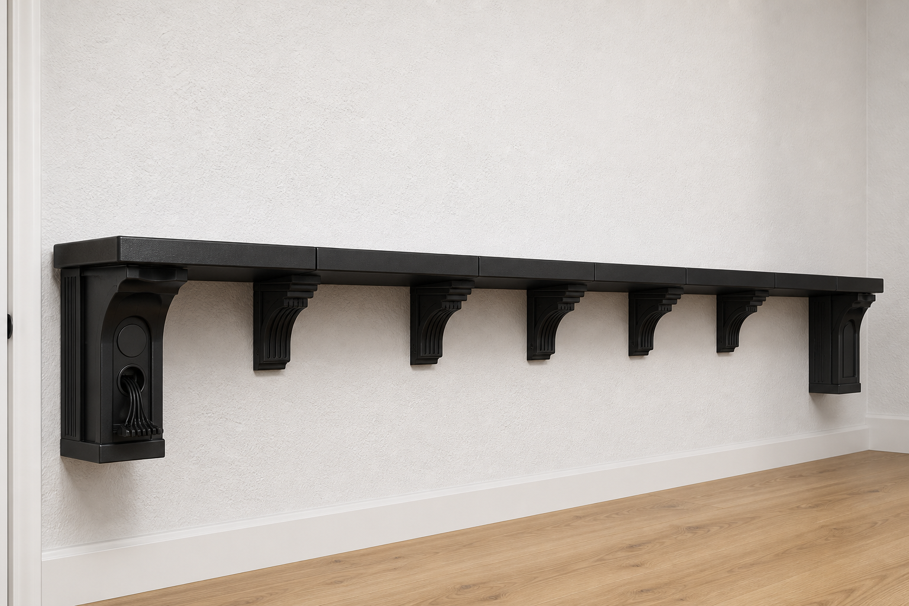
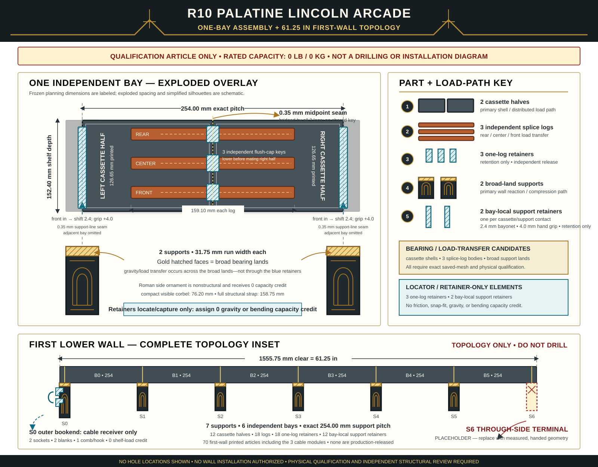

# R10 Palatine Lincoln-log arcade shelf

> **Engineering prototype only. Rated load: 0 kg / 0 lb.** Do not use these
> files as permission to drill the wall, install a shelf, or store any load.
> R10 defines a predominantly printed candidate architecture and the physical
> evidence it must earn. Until every release gate closes, it is not an
> installable product.

## Scope frozen for this revision

R10 addresses only the first, lower shelf on the measured 61.25 in
(1555.75 mm) through/outlet wall. Its intended top elevation is 68 in and its
projection is 6 in (152.4 mm). The return wall, the 84 in upper level, and the
inside corner remain later work.

The outlet faceplate reaches approximately 53.5 in above the floor. The
finished layout must preserve access to both receptacles, plugs, cords, and the
faceplate screws. Wall bow, trim, blocking, substrate, and the exact field
termination still require physical records before any wall release.

## Correct the old 16 kg statement

The frozen R6 values `16.000337 kg per level / 32.000674 kg for two levels`
are repeat-weighted **CAD solid mass**, not carrying capacity. They never
established a shelf rating. R9 and R10 remain rated at exactly **0 kg / 0 lb**.

R10 consequently seeks a shorter, redundant printed load path rather than
adding undifferentiated plastic mass.



This render is visual intent only: it communicates the compact Roman/Art-Deco
rhythm, shorter intermediate corbels, segmented fascia, and emphasized outer
bookend. It is not CAD, a part-count record, an assembly drawing, a drilling
template, or proof of strength. Source geometry and validated saved meshes
control whenever the image differs.



The vector diagram is the frozen **qualification topology**, not a drilling
template or load proof. It shows the actual one-bay article families, the
retainer order, and how six independent bays tile across the first wall. The
exact assembly motions and stop conditions are controlled by
[`ASSEMBLY.md`](ASSEMBLY.md); the safest print order is controlled by
[`PRINT_FIRST.md`](PRINT_FIRST.md).

## Selected all-PETG shelf architecture

The active shelf chassis contains no aluminum tube, metal beam, or metal
bearing strap. Its structural shelf parts are SUNLU PETG; metal is limited to
the candidate wall screws and one washer beneath each screw head.

Across the 61.25 in run, seven 31.75 mm-wide Palatine supports sit on exact
10 in (254 mm) centers. They create six independent bays:

```text
wall end                                                     wall end
   S0 ---- bay 1 ---- S1 ---- bay 2 ---- ... ---- bay 6 ---- S6
       half | half          half | half
            ^                    ^
       3 splice logs        3 splice logs
       + 3 log keys         + 3 log keys
      bay-local support keys retain each cassette end without carrying gravity
```

Each bay contains:

- two full-depth PETG cassette halves;
- rear, center, and front PETG splice logs crossing the midpoint seam;
- captured dovetail channels and positive body shoulders, with 0.4 mm
  clearance per face;
- three independent removable retainers, one preventing walkout of each log;
  and
- direct cassette-end bearing on the broad half-lands of the adjacent support
  capitals.

Each one-log retainer has an integrated cap: its 6.0 mm run closes the
left-half top access flush when the key seats. There are no separate loose
debris covers. The final saved key envelope is 12.4 x 28.0 x 10.8 mm.

Each bay also receives two front-inserted support retainers after its cassette
ends are seated. The 12 bay-local keys have separate left/right functions at
interior supports, so one loose key cannot affect an adjacent bay. They resist
accidental lift only; the uninterrupted land above each key carries gravity.
Each has a 3.8 mm run-width shaft, 8 mm-deep rear dog, and 12 mm-deep front
handle. After straight insertion, a 2.4 mm shift toward its bay puts the dog
behind a positive shoulder while the paddle remains 4.0 mm proud of the shelf
front for a reversible hand grip; no friction or snap is credited.

The two outer cassette halves are longer terminal parts; the ten interior
halves are regular parts. A failed or damaged bay can be removed without
unzipping the complete 61 in run. Adhesive, snap preload, friction, the
retainers, shallow locators, and anti-lift retention receive no sustained
vertical-load credit.

The dovetail and top-open key notch reduce the splice log's real midpoint
section. Final-mesh geometry—not a gross 20 x 24 mm rectangle—controls the
proxy: net area is 334.800 mm² (72.16% of gross), centroidal second moment is
8263.957 mm⁴ (36.85% of gross), and governing elastic section modulus is
949.016 mm³ (51.35% of gross). Those are geometric comparisons only; they
contain no PETG allowable and create no load rating.

Printed halves preserve 0.35 mm at every midpoint seam, 0.35 mm centered over
each interior support line, and 0.35 mm at each wall endpoint. The stepped
fascia looks continuous but remains physically segmented for thermal movement
and one-bay removal.

The intended primary load path is:

```text
stored object
  -> PETG top skin and rear/center/front cassette webs
  -> three captured PETG splice logs at each bay seam
  -> direct bearing on seven PETG support capitals
  -> seven PETG wall straps / straight compression webs
  -> 21 GRK 90306 screw-and-washer candidates
  -> verified continuous blocking or an independently engineered equivalent
```

Generic drywall or hollow-wall anchors are not part of that path. A wall screw
catalog value is not a shelf rating.

## Palatine Moderne is structural honesty, not camouflage

The visible language is a black Roman aqueduct interpreted through Art-Deco
stepping: short repeated arches, stepped keystones, a continuous fascia, and
stronger outer bookends. The efficient mechanics remain straight wall straps,
compression webs, top chords, broad bearing lands, skins, and splice logs.

Ordinary intermediate corbels expose only a compact 76.2 mm visual drop while
the full 158.75 mm structural wall strap remains hidden. The far-left outer
bookend may extend its visible emphasis to 120.65 mm. The through-side terminal
is a replaceable corner placeholder, not a final measured corner or an outer
bookend.

Every arch recess and decorative step is additive-only or placed outside the
minimum structural envelope. Ornament may not thin a wall strap, screw or
washer land, compression web, support capital, cassette skin/web, dovetail,
log shoulder, or keyway. The Roman curve and keystone receive zero independent
structural credit.

## Cable pegs are a frozen interface

Cable organization may appear **only on the two outer bookends of the eventual
L-shaped shelf level**:

- the far-left endpoint of this first wall; and
- the far-right endpoint of the later return wall.

Each outer bookend has exactly one fused receiver containing exactly two
inward-facing sockets. Each socket uses the proven keyed gravity interface,
0.4 mm clearance per face, and 8 mm service lift/drop. The printable module set
must include a flush blank and a multi-cable comb/hook. Blank every unused
socket so the shelf can read as ordinary furniture.

There is no cable rail, peg, receiver, or module on an intermediate support,
the through-side terminal/corner placeholder, or the inside corner. Cable parts
receive zero structural credit. The first-wall prototype activates only its far-left
bookend; the second outer bookend is deferred until the return-wall geometry
exists.

## Qualification objective—not a rating

The ambitious physical objective is 45 kg (approximately 100 lb) of uniformly
distributed contents per level plus a separate 9 kg (approximately 20 lb)
front-edge point-load case. The total proof demand is `1.5 x (dead mass + 45 kg
contents)`. Because the physical shelf already supplies its own dead mass, the
external ballast is:

```text
1.5 x (measured finished-shelf dead mass + 45 kg contents)
- measured finished-shelf dead mass
```

These numbers define test inputs only. They do not become an allowable load by
appearing in CAD, software, or documentation. The complete staged protocol is
in [`LOAD_QUALIFICATION.md`](LOAD_QUALIFICATION.md).

The separate point-proof case also factors the existing shelf dead mass. Under
the current 1.5x study rule, the shelf supplies `D`; the fixture adds a
representatively distributed `0.5D` plus the 13.5 kg factored point mass. A
reviewer may replace those load factors only through a recorded test revision.

Before the sustained test, measure the maximum temperature the shelf will see
in representative service. The creep article then dwells for 1000 hours at
that measured maximum plus 5 degrees C; the extra temperature is a controlled
qualification margin, not permission to use the shelf in a hotter environment.

## Fastest responsible path to a printable shelf

The print strategy deliberately fails fast and spends filament in this order:

1. **Actual midpoint interface:** print one authored left cassette half, one
   authored right half, one splice log, and its flush-capped retainer. Cycle the
   real interface ten times; reject cracking, shaving, uncontrolled looseness,
   a proud cap, or forced assembly.
2. **Complete one actual structural bay:** reuse those four passing articles,
   then print the remaining two logs, two log retainers, two bay-local support
   keys, and two supports, one part per plate in the authored orientation. Off
   the supports, seat all three logs in the left half; while the right half is
   absent, lower one key through each left-half top access into its exposed log
   notch. Then slide the right half over the logs and captured key ends. Lower
   that joined cassette onto the two broad support contacts; insert each long
   support key from the front and shift it 2.4 mm toward its bay to engage the
   positive rear stop. Inspect direct bearing, flush key closures, seam
   closure, independent removal, and layer quality.
3. **One cable bookend set:** print the far-left fused two-socket receiver, its
   two flush blanks, and one comb/hook. Verify inward orientation, 8 mm service
   motion, cord clearance, and ordinary-shelf appearance.
4. **Complete tabletop set:** only after the midpoint-interface and one-bay
   gates pass, print the
   remaining parts. Assemble all six bays without screws or a wall and verify
   the measured length, support centers, flatness, replaceability, outlet
   clearance model, and that no single key can release adjacent bays.
5. **Framed-wall mockup:** only after blocking and substrate are known, build a
   sacrificial fixture and follow the qualification gates. The real closet wall
   is not the first fixture.

Before every printer start, the operator must confirm the plate is empty and
clean, the physical 0.4 mm nozzle and exact PETG are loaded, the correct profile
is selected, and the intended single-part plate is in Preview. Do not send a
print merely because slicing succeeded.

## Baseline print contract

- Bambu Lab A1 mini, physical 0.4 mm nozzle, Textured PEI plate.
- SUNLU standard black PETG, 1.75 mm, ASIN `B0D1KC72YP`; record the received
  label, spool lot, and drying cycle.
- `SUNLU PETG @BBL A1M 0.4 nozzle` filament profile and
  `0.20mm Strength @BBL A1M` process profile.
- Six walls, 25% grid infill, five top layers, three bottom layers, Support
  Off, 5 mm outer brim, and 0.1 mm brim-object gap.
- Authored orientation, 100% scale, one structural part per plate, manifold
  geometry, and Bambu Preview inspection. Never auto-orient, auto-scale,
  casually mirror, or accept slicer repair for a structural part.

Every part must fit the A1 mini's 180 x 180 x 180 mm volume after including
the brim, the 0.1 mm gap, and 2 mm additional reserve at every bed edge.

## Current release blockers

R10 does not yet provide a released production STL/3MF set, G-code, drilling
template, verified wall map, passed one-bay fixture, passed full-wall mockup,
proof result, sustained-creep result, recovery result, destructive result, or
independent structural review. Therefore it supplies no installation
authorization and no load rating.

Use [`GUIDELINES.md`](GUIDELINES.md) as the compact pre-change checklist and
[`DESIGN_REQUIREMENTS.md`](DESIGN_REQUIREMENTS.md) as the detailed controlling
contract. Use [`MATERIALS_AND_HARDWARE.md`](MATERIALS_AND_HARDWARE.md) for the
complete candidate bill of materials and [`LOAD_QUALIFICATION.md`](LOAD_QUALIFICATION.md)
for the physical evidence required before any rating or wall release.
