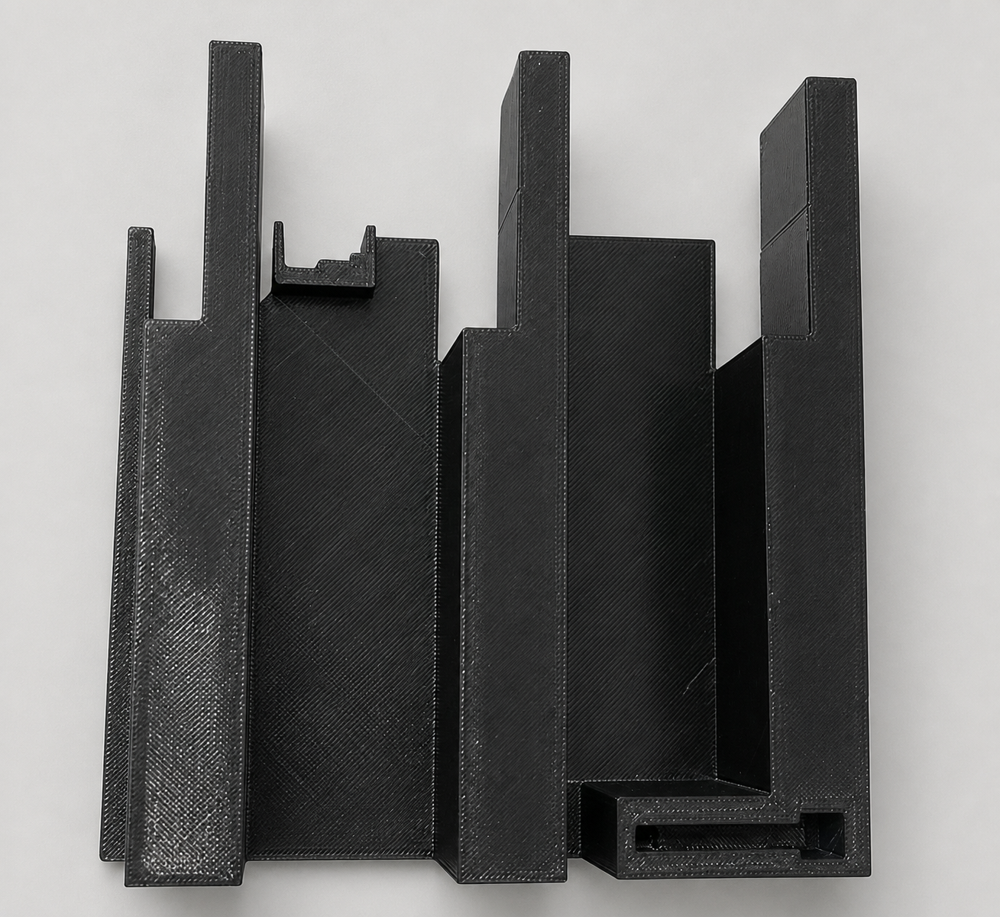

# R11 one-bay physical handoff

> **Tabletop fit study only. Current rating: 0 kg / 0 lb.** Nothing in this
> folder authorizes another print, wall work, hardware installation, or load.

This is the short, plain-language guide for the two large pieces that make the
first bay of the shelf. The left piece has been printed and photographed. The
right piece was last reported as still printing; its result has not been
recorded yet. The exact evidence boundary is in
[PHYSICAL_RECORD.md](PHYSICAL_RECORD.md).

The frozen neutral bundle contains two known copied-document links that are
source-relative and therefore do not resolve from inside the bundle. Read the
[frozen-artifact errata](FROZEN_ARTIFACT_ERRATA.md) before following a link
from a copied handoff document. The artifact bytes remain unchanged.

The controlled v2 overlay also has an intentional public device-binding
privacy tradeoff. Read [PRIVACY_NOTE.md](PRIVACY_NOTE.md); it publishes no raw
serial or credential, and this documentation does not alter that frozen gate.

## What exists right now

- **Left half:** printed, cooled, removed, and visually observed flat with no
  rocking and no visible finger flex. It was not sanded. This is an observation,
  not a complete fit or strength pass.
- **Right half:** print in progress at the last update. Do not treat it as a
  finished part until it has completed, cooled, been removed, and passed the
  same simple visual checks.
- **One-bay dry fit:** not started.
- **Supports and keystone:** not part of this next step.

Use these picture guides with the cards below:

- [six-card one-bay dry-fit guide](visuals/one_bay_dry_fit_steps.svg)
- [close views of the three laps and later support capture](visuals/joint_closeups.svg)

Cleaned reference view of the printed left half:

This edited image is only an orientation aid. The source-photo identities,
exact edit prompt, retained C2PA provenance, output hash, and evidence limits
are recorded in [the photo provenance](photos/README.md). Do not use the
cleaned image for dimensions, contact, flatness, or capacity.

For a future Codex task, use the
[copy-paste continuation and full-validation prompt](NEXT_ENGINEER_PROMPT.md).
It preserves this physical boundary and requires the full regression and
publication checks before another engineering release.

## Before the first dry fit

Proceed only when the right half has finished, fully cooled, and been removed
from the plate. Set both halves on a clean, flat table.

Use clean hands only. **No sanding, file, lubricant, heat, glue, tools, force,
wall, screws, or weights.** Do not trim or reshape either structural part. Do
not install the keystone and do not place either half on supports yet.

## The next dry fit — one card at a time

### Card 1 — Check the right half

Look at every finger, slot, broad flat face, and outside edge.

**PASS:** it is fully cooled, lies flat without rocking, and has no crack,
white stress mark, lifted layer, loose strand, or visibly bent finger.

**STOP:** any item above is not true. Photograph it and leave the parts apart.

### Card 2 — Confirm the pair

The labels for this pair are:

- left: `r11_bay0_left_terminal_integrated_half_deck`
- right: `r11_bay0_right_terminal_integrated_half_deck`

Put the two top faces upward. Point both wall-side edges the same way. Keep the
front edges on the same side. Follow the labels and arrows in the
[six-card guide](visuals/one_bay_dry_fit_steps.svg); do not mirror or guess a
different motion.

**PASS:** the two parts match the labeled left/right picture.

**STOP:** the orientation is uncertain or either identity is uncertain.

### Card 3 — Line up all three laps

Keep both pieces off the supports. Bring the two halves together just far
enough to line up the rear, center, and front reciprocal laps. All three rows
must start together. Keep the broad faces parallel.

**PASS:** all three rows line up at the same time while the parts remain
relaxed in your hands.

**STOP:** one row collides, one row starts much earlier, or the pieces must be
twisted to line up.

### Card 4 — Make the first gentle fit

Move the halves together by hand in the single straight direction shown in the
guide. Stop as soon as the broad faces and body shoulders seat. Keep the
designed center seam; do not try to squeeze the seam to zero.

**PASS:** all three laps seat with gentle hand motion and the joined top stays
flat, without rocking or twisting.

**STOP:** the motion binds, scrapes, shaves material, makes PETG dust, needs a
push, leaves a lap partly seated, makes a crack or white mark, or bends a
finger. Separate the pieces by reversing the same straight motion.

### Card 5 — Inspect the joined pair

Look from the top, front, rear, and both ends. Photograph the full pair and a
close view of each of the three lap rows.

**PASS:** three full lap contacts are visible, the shoulders are seated, the
top is even, the part does not rock, the seam is consistent, and there is no
new damage.

**STOP:** there is a proud row, trapped strand, growing gap, rock, twist,
damage, or unclear contact. Do not use a keystone to pull a gap closed.

### Card 6 — Reverse once, then use the 1 / 5 / 10 checkpoints

Reverse the same straight hand motion and inspect both halves again. This is
**cycle 1**.

- If cycle 1 passes, repeat gently until **cycle 5**, then inspect and
  photograph again.
- If cycle 5 passes, repeat gently until **cycle 10**, then inspect and
  photograph again.
- If any cycle stops being easy and reversible, stop immediately. Do not
  continue to reach a number.

**PASS at a checkpoint:** the motion remains gentle and reversible, all three
laps still seat, and there is no shaving, dust, whitening, crack, looseness,
rock, twist, or permanent bend.

**STOP:** any condition changes or any doubt appears. Leave the parts apart and
record the cycle number.

## What happens after a 10-cycle dry-fit pass

Stop and record the result. A pass here means only that these two halves can be
joined and separated unloaded on a table. It does **not** authorize more
printing, the keystone, supports, installation, or load.

The later engineering sequence is documented in:

- [R11 provisional dry tabletop assembly](../r11/ASSEMBLY.md)
- [R11 exact model manifest](../r11/generated/first_outer_actual_bay_qualification_v1/manifest.json)
- [R11 physical qualification protocol](../r11/LOAD_QUALIFICATION.md)
- [frozen Gate A-left control overlay](../r11_print_v2/README.md)

Those documents remain the detailed engineering record. This page is only the
beginner-friendly handoff for the immediate two-half tabletop check.
