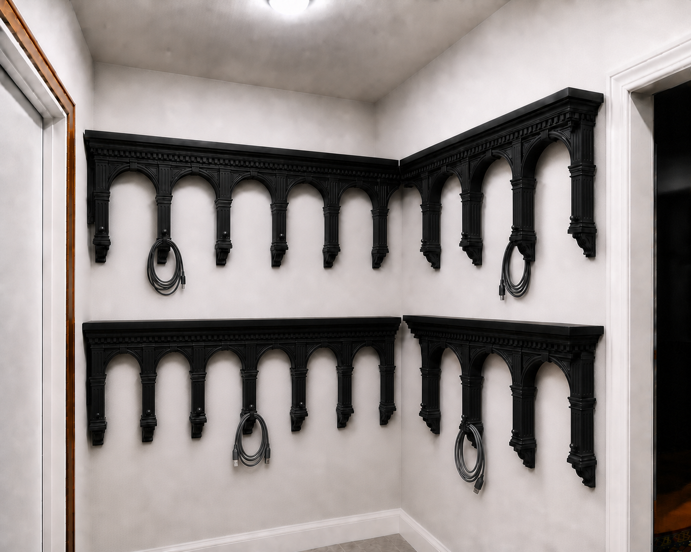
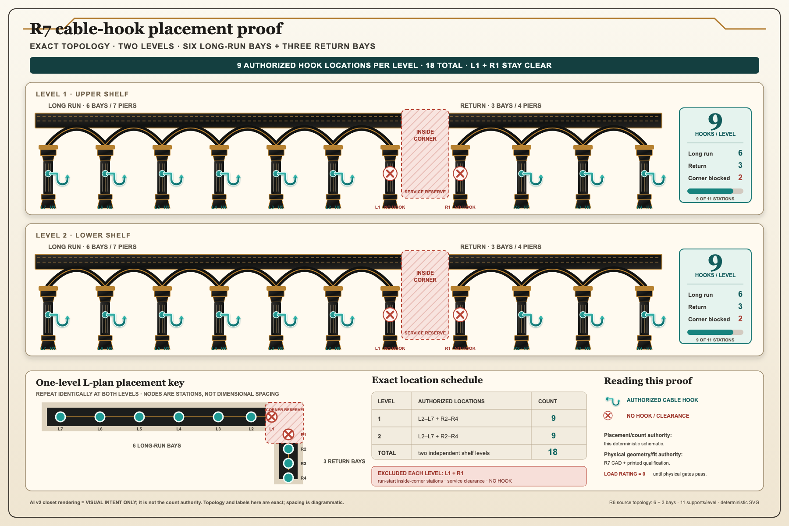
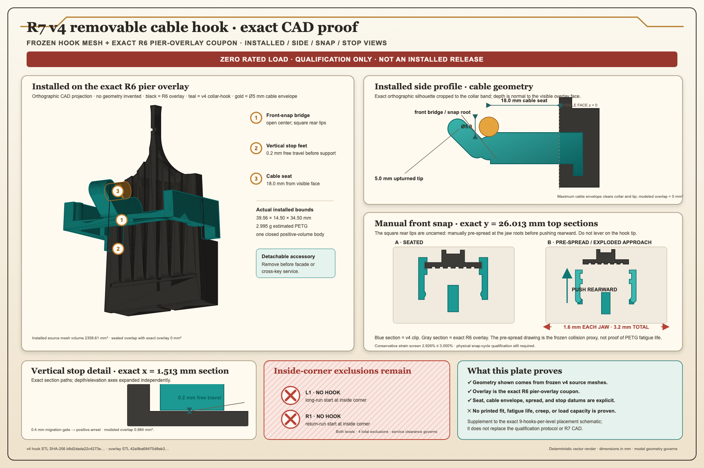

# Story Corner R7 removable column cable hooks

R7 adds a detachable black-PETG cable hook to the removable decorative column
faces without changing the published R6 shelf, structural corbels, pier
overlays, joinery, package counts, or Bambu qualification bundle.



> **AI visual-intent image only:** the v2 rendering above is not a build
> diagram, counted inventory, or printable model. It may simplify, omit,
> repeat, or misplace hooks. The exact hook count and permitted locations are
> governed by the generated CAD, configuration, and schematic—not by the AI
> rendering.

## Exact placement and count authority



The deterministic schematic above is the placement-and-count authority:
`L2–L7` and `R2–R4` are the nine authorized hook stations on each shelf level;
`L1` and `R1` are the two excluded inside-corner run-start stations. The
two-level project therefore has exactly 18 authorized hook locations and four
excluded stations. Station spacing in this schematic is diagrammatic, not an
installation dimension. The R7 CAD and printed qualification remain the
authority for physical geometry and fit, and the rated load remains zero.

The [vector schematic](assets/cable_hook_location_proof_exact.svg),
[artifact manifest](assets/cable_hook_location_proof_exact.manifest.json), and
[proof notes](assets/cable_hook_location_proof_exact.NOTES.md) record the
source topology, exact station list, counts, digests, and limitations.

## Exact v4 collar geometry proof



This deterministic plate is rendered from the frozen v4 hook STL and exact R6
pier-overlay coupon. It explains the installed collar, open-center bridge,
`18 mm` cable seat, maximum `5 mm` cable envelope, manual `1.6 mm` per-jaw
pre-spread, positive vertical stop, and the two inside-corner exclusions. It
is a geometry explanation—not evidence of printed fit, fatigue, creep, load
capacity, or production readiness. The [vector source](assets/cable_hook_cad_proof_v4.svg),
[asset manifest](assets/cable_hook_cad_proof_v4.manifest.json), and
[deterministic renderer](assets/render_cable_hook_cad_proof_v4.py) preserve its
provenance.

The generated qualification models and physical test record govern the
printable accessory. This remains a **qualification-only, zero-rated-load**
development article; generating, opening, slicing, or printing it does not
approve installation or use.

## What changed

- One front-snap C-collar/hook fits the unchanged R6 pier overlay.
- The collar seats at overlay-local elevation `22–30 mm` and clears the exact
  rear locator housing.
- The rounded hook provides `18 mm` of usable projection with a `5 mm`
  upward-retaining tip.
- Nine normal-facing hooks are possible per shelf level: the seven interior
  and two run-end columns.
- The two run-start columns flanking the inside corner stay clear. Their
  service-swept plan reserve is only `4.2325 mm`, so an `18 mm` normal hook is
  prohibited there.
- The accessory is removed before any ornament, cross-key, bridge, cassette,
  arcade, or corbel service.

R6 remains the released baseline at `258` objects per level and `516` for two
levels. If every physical R7 gate passes and nine hooks are promoted per
level, the counts become `267` and `534`. The hook receives no shelf-load or
structural credit.

## Generate and open the v4 qualification models

The instructions below are for **Bambu Studio 2.7.1.62** on a **Bambu Lab A1
mini with a 0.4 mm nozzle and Textured PEI Plate**. Generate a fresh v4
model-only qualification set from the repository root:

If the checked v4 directory already exists, do not run this command; open the
file below. The generator intentionally refuses to overwrite an existing
output directory.

```sh
.venv/bin/python development/r7/generate_cable_peg_qualification.py \
  --output development/r7/generated/cable_peg_qualification_v4
```

The combined qualification file is:

`development/r7/generated/cable_peg_qualification_v4/model_only_3mf/MODEL_ONLY_R7_CABLE_PEG_COLUMN_QUALIFICATION.3mf`

`cable_peg_qualification_v1`, `cable_peg_qualification_v2`, and
`cable_peg_qualification_v3` are superseded development history and must not
be used for printing, even if an old copy has not been renamed with a
`_SUPERSEDED` suffix.
The preserved `cable_peg_qualification_v4_pre_serialization_fix_SUPERSEDED`
tree is also forbidden: its hook STL and 3MF used different numeric vertex
precision. Only the active `cable_peg_qualification_v4` tree has the enforced
STL/individual-3MF/canonical-package geometry bijection.

The v4 combined file contains exactly three unsliced objects:

1. the exact R6 pier-overlay parent coupon;
2. the removable collar-hook, saved on a run-side face; and
3. the `0.20 / 0.30 / 0.40 / 0.50 mm` per-face clearance ladder.

### Neutral 3MF warning

The v4 file is a **neutral model-only 3MF**. It contains no G-code or
toolpath, and it does **not** embed or select the printer, nozzle, plate,
filament, temperatures, process, brim, or supports. Opening the file in Bambu
Studio does not apply the settings below. Studio may retain whatever was used
last, including PLA.

**Never reuse, copy, or edit a PLA profile for this PETG print. Never press
Slice plate or Print plate until every field below has been selected and
verified.**

## First-time PETG preparation

1. Confirm the spool is SUNLU standard black PETG 1.75 mm, retail ASIN
   [`B0D1KC72YP`](https://www.amazon.com/dp/B0D1KC72YP). Record its color,
   lot/batch, spool identity, and date.
2. Dry the exact spool at **60–65 °C for 6–8 hours** in a filament dryer rated
   for that temperature. Record the dryer, indicated temperature, start and
   end times, and exact cycle. A sealed new bag is not proof that PETG is dry.
3. With the Textured PEI Plate removed and cool, wash the print surface with
   dishwashing detergent and water, rinse it, and dry it completely. Do not
   use acetone and do not touch the cleaned print area.
4. Reinstall the clean plate in the correct orientation. Load the dried PETG
   and confirm that both the printer and Bambu Studio identify the intended
   PETG—not PLA.

## Exact Bambu Studio setup

In Bambu Studio's **Prepare** view, select these exact installed system
presets and values. If the SUNLU system preset is not available, stop and
enable/update the Bambu system presets; do not substitute a PLA preset.

| Bambu Studio field | Required qualification value |
| --- | --- |
| Printer | `Bambu Lab A1 mini 0.4 nozzle` |
| Plate type | `Textured PEI Plate` |
| Filament system preset | `SUNLU PETG @BBL A1M 0.4 nozzle` |
| Process system preset | `0.20mm Strength @BBL A1M` |
| Layer height | `0.20 mm` |
| Nozzle temperature | `250 °C` first layer; `245 °C` other layers |
| Textured-plate temperature | `60 °C` first and other layers |
| Flow ratio | `0.94` |
| Maximum volumetric speed | `9 mm³/s` |
| Wall loops | `6` |
| Top / bottom shell layers | `5 / 3` |
| Sparse infill | `25%`, `grid` |
| Part cooling | Leave the SUNLU system values unchanged: `10%` minimum, `30%` maximum, `90%` for overhangs |

Then make these explicit overrides; the selected system process does not set
them all correctly for this qualification plate:

- Under bed adhesion, set `Brim type` to `Outer brim only`, `Brim width` to
  `5 mm`, and retain the inherited `Brim-object gap` of `0.1 mm`.
- For the clearance-ladder print, leave `Enable support` off so support does
  not contaminate its four measurement openings.
- For the parent-coupon and collar-hook print, turn `Enable support` on, set
  `Type` to `normal(auto)`, and check `On build plate only`.

Select each object and verify scale is exactly `100%` on X, Y, and Z. Keep the
v4 saved positions and orientations. Do not use Auto arrange, Auto orient,
Lay on face, scale-to-fit, unit conversion, Cut, or any repair operation that
changes geometry. If Studio asks to repair or resize a model, cancel and
recheck that the exact v4 file was opened.

The collar is intentionally saved with its left tapered run-side jaw face flat
on the plate. Do not stand the hook projection upright and do not put the
column-visible face on the plate.

## Print job 1 — clearance ladder first

Open the v4 individual ladder file so there is no chance of accidentally
printing the other two objects. Unlike the superseded individual files, v4
includes the plate-edge translation required by the `5 mm` outer brim and
`0.1 mm` brim-object gap:

`development/r7/generated/cable_peg_qualification_v4/individual_model_only_3mf/MODEL_ONLY_R7_DEV_CABLE_PEG_COLLAR_CLEARANCE_LADDER_0P2_0P3_0P4_0P5.3mf`

Apply the exact printer, PETG, process, temperature, flow, infill, shell, and
brim settings above, with `Enable support` off. Its four openings run
left-to-right from `0.20` to `0.50 mm` clearance per face.

Click `Slice plate`, not `Print plate`, and complete the preview checks below.
Only after the preview passes should this one ladder be printed and inspected.

## Print job 2 — parent coupon plus collar-hook

Reopen the combined v4 qualification file. In the Objects list, select
`R7_DEV_CABLE_PEG_COLLAR_CLEARANCE_LADDER_0P2_0P3_0P4_0P5`, right-click it,
and choose `Set Selection Unprintable`. Confirm that only these two objects
remain printable:

- `R7_DEV_CABLE_PEG_EXACT_R6_PIER_OVERLAY_COUPON`;
- `R7_DEV_CABLE_PEG_FRONT_SNAP_C_COLLAR_HOOK`.

Reapply and verify every exact setting above. For this job, set `Enable
support` on, `Type` to `normal(auto)`, and `On build plate only` on. Do not
rotate or rearrange either object.

## Preview and first-layer stop checks

After each `Slice plate`, move the layer slider through **every layer** before
printing. Do not dismiss a warning. Confirm all of the following:

- the expected object or objects—and no others—have complete first-layer
  paths;
- every outer brim is continuous, remains inside the A1 mini printable
  boundary, and does not touch another brim;
- no object, brim, or support crosses a plate boundary or keep-out area;
- the ladder has no generated support in its measurement openings;
- on job 2, normal-auto support starts only from the build plate and does not
  fill the collar cavity or a coupon fit surface;
- the collar jaws, rear lips, hook root, projection, and upturned tip remain
  continuous in every layer;
- there are no floating regions, missing paths, collisions, empty initial
  layers, scale/repair notices, or out-of-bounds warnings.

If any check fails, stop. Do not improvise a new orientation or support layout
and do not print; record the Studio version, warning, settings, and screenshot
for engineering review.

Stay with the printer through the first layers. Stop the print immediately for
any lifting or curling, a detached brim or support, nozzle contact or scraping,
missing or intermittent extrusion, clicking or popping from wet PETG, severe
stringing, layer separation, or a toolpath that differs from Preview.

When a print finishes, wait until the Textured PEI Plate is **35 °C or below**
before removing it. Remove the cooled flexible plate and flex it gently; do not
pry hot PETG from the installed plate. Label and retain each specimen with the
date, Studio version, printer, nozzle, plate, spool/lot, drying cycle, and saved
profile.

## Fit sequence

1. Inspect and record the clearance ladder before selecting a fit.
2. Start with the frozen `0.40 mm` collar; do not scale or edit the mesh based
   only on the ladder.
3. The square rear lips have no automatic insertion cam. At the jaw roots,
   manually pre-spread **each jaw by at least `1.6 mm`** before pushing the
   collar rearward onto the parent coupon at the `22–30 mm` band. It is a
   front-snap part, not a top- or bottom-slide part. Never force insertion by
   pushing, pulling, or levering on the hook tip.
4. Reject the fit if it rattles, whitens, cracks, scratches the overlay, cannot
   be removed by hand, migrates more than `0.4 mm`, or obstructs an existing
   access opening.
5. Remove every cable and collar before servicing the shelf facade or joinery.

## Load status and qualification

The present rated load is **zero**. A printed part is still a test specimen,
not an approved cable hanger. The three-object coupon plate qualifies only
clearance, fit, and snap behavior; it cannot qualify the hook load path.

Every proof, cycle, creep, and migration load gate must use the exact printed
overlay installed on its real relevant R6 X-corbel/full assembly. A loose
overlay coupon or substitute fixture does not count. Apply each test load at
the cable seat exactly `18.0 mm` from the overlay visible face. Tip-applied
load is prohibited.

The `0.25 kg` working value below becomes available only after all tests pass
on the exact SUNLU-PETG print/profile and assembly:

- 100 complete snap-on/removal cycles;
- 1,000 cycles from zero to `0.25 kg` working load;
- 20 thermal cycles from `10–45 °C`, dwelling at least four hours at each end
  while carrying the working load;
- `1.00 kg` downward proof load for one hour;
- `0.50 kg` sustained creep load for 90 days;
- 72 hours unloaded recovery; and
- a separate destructive sample.

Fail on crack, whitening, jaw escape, overlay damage, loss of tool-free
release, migration over `0.4 mm`, accelerating deflection, or permanent hook
tip set over `0.5 mm` after recovery.

After qualification, use the hooks only for loose lightweight cable loops.
The maximum qualified cable or bundle outside diameter is `5 mm`; a larger
cable or bundle requires a new fit and load qualification. Do not hang
garments, bags, tools, leashes, tensioned extension cords, or any item a
person might pull. Hook loads never contribute to the shelf rating.

The drying and plate-care baseline is grounded in the
[SUNLU filament drying guide](https://www.sunlu.com/wiki/filament-usage-guide)
and [Bambu Textured PEI Plate guidance](https://us.store.bambulab.com/products/bambu-textured-pei-plate).

## Files

- [Exact R7 geometry contract](config.json)
- [Cable-hook geometry source](cable_peg_geometry.py)
- [Qualification generator](generate_cable_peg_qualification.py)
- [Geometry and artifact tests](tests/test_cable_peg_geometry.py)
- [Focused Bambu/PETG documentation tests](tests/test_cable_peg_readme.py)
- [Exact hook placement/count PNG](assets/cable_hook_location_proof_exact.png)
- [Exact hook placement/count SVG](assets/cable_hook_location_proof_exact.svg)
- [Exact visual manifest](assets/cable_hook_location_proof_exact.manifest.json)
- [Exact visual notes](assets/cable_hook_location_proof_exact.NOTES.md)
- [Exact v4 collar CAD proof PNG](assets/cable_hook_cad_proof_v4.png)
- [Exact v4 collar CAD proof SVG](assets/cable_hook_cad_proof_v4.svg)
- [Exact v4 collar CAD proof manifest](assets/cable_hook_cad_proof_v4.manifest.json)
- [Exact v4 collar CAD proof renderer](assets/render_cable_hook_cad_proof_v4.py)
- [Current concept rendering](assets/artist_rendering_all_petg_two_level_cable_pegs_concept_v2.png)
- [Rendering prompt and digest](assets/artist_rendering_all_petg_two_level_cable_pegs_concept_v2.prompt.md)
