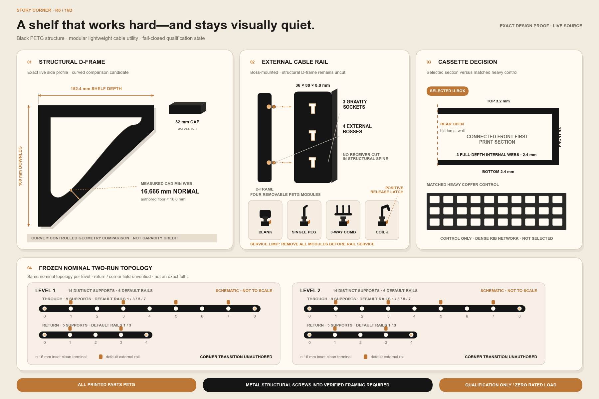

# Story Corner R8 — 16B structural D-frame scaffold

R8 translates the selected black 16B visual direction into a deliberately simple,
**100% PETG printed-parts** shelf system: two cassette shelf levels, compact
curved D-frame corbels, and removable cable accessories on safe interior
supports. The required wall fasteners are metal structural screws, not printed
parts. Black is the color direction, not a guaranteed matte finish; ordinary
SUNLU PETG can show gloss that varies with temperature, speed, surface angle,
and layer direction. This directory is a qualification scaffold, not a
production release.



The image above is a deterministic drawing generated from the live R8 source,
not a generative artist rendering. The matching SVG, source-linked manifest,
and renderer are in `assets/` and `render_proof.py`.

## Current source and artifact status

- The structural D-frame, an equal-volume straight control, the selected
  lightweight cassette, its heavier coffer control, the additive cable rail,
  four retained cable modules, and a four-clearance fit ladder are exact CAD.
- `generated/qualification_v1/` is **superseded and quarantined: do not print
  its D-frame, controls, cassette, rail, retained modules, or combined catalog**.
  It predates the final inward boss lanes and retained-module print-orientation
  contract. Keep it only as historical evidence; its own README is obsolete.
- `generated/qualification_v2/` is the current 15-part unsliced component and
  fit-coupon set. `generated/one_bay_qualification_v2/` is the current exact
  five-part cassette/support/rail/blank fit assembly. Their manifests bind the
  current source, PETG profile, geometry digests, runtime, and neutral 3MFs.
- Both v2 folders remain **qualification-only and zero-rated**. They authorize
  controlled fit printing, not wall installation, a complete shelf print, or
  any stored load.
- No existing artifact authorizes wall installation or load.

## Frozen nominal architecture

- Shelf depth: **152.4 mm (6 in)**; cassette height: **30.0 mm**.
- D-frame prototype: **152.4 × 160.0 × 32.0 mm** with 16.0 mm top and wall
  chords, a required 16.0 mm curved working web and an actual CAD minimum of
  **16.6663 mm**, a 32.0 mm front nose, and R10 inner roots. The longer downleg
  creates a clean rail zone.
- Through run: **1514.475 mm**, 8 cassette modules, 9 corbels.
- Return prototype run: **751.275 mm**, 4 cassette modules, 5 corbels. It
  starts 1.2 mm beyond the through deck's nominal front plane and ends at the
  existing 911.225 mm outer datum; both values remain field-unverified.
- Terminal corbel centers are inset 16.0 mm. Each corbel has a 32.0 mm bearing
  cap, so the terminal caps finish flush with the nominal run ends.
- Each 0.35 mm cassette seam is centered on an interior 32.0 mm cap. The seam
  leaves 15.825 mm of cap bearing beneath each adjacent cassette edge.
- The first and last corbel of each run are kept clean for corner and doorway
  clearance. Accessory eligibility is derived from support topology: 7 through
  plus 3 return corbels per level, not a hard-coded total.

The return length remains a prototype reference until the closet is measured.
R6's ornament-driven return start and asymmetric inset are intentionally not
carried into this simpler design.

Ten interior supports per level are geometrically rail-eligible, but the clean
default equips only alternating stations: through 1/3/5/7 and return 1/3
(zero-based within each run). That is **6 rails / 18 sockets per level**, or
12 rails / 36 sockets for both levels. The other supports remain visually
smooth; every run endpoint and inside-corner support is hard-excluded.

The seam-on-support layout uses **14 corbels and at least 42 metal structural
screws per level** (28 / 84 for both levels). It therefore assumes continuous
blocking or an independently verified equivalent framing plan. That framing is
not yet confirmed, and printed or hollow-wall anchors cannot substitute.

## Bambu Studio PETG starting profile

Use these only for qualification parts and coupons:

- Printer: Bambu Lab A1 mini; 180 × 180 × 180 mm build volume.
- Selected filament: SUNLU PETG, ASIN
  [B0D1KC72YP](https://www.amazon.com/dp/B0D1KC72YP?ref=ppx_yo2ov_dt_b_fed_asin_title&th=1),
  listing variant **4 kg / 2 Black + 2 Black** (four black 1 kg spools),
  1.75 mm ±0.02 mm. Confirm the received labels still say PETG and Black;
  Amazon listing variants can change. Record the exact spool lot before every
  qualification print. This project identifies the spool as standard PETG,
  not SUNLU High-Speed Matte PETG; do not infer a matte finish from the black
  concept image. PLA is not permitted for any R8 printed part.
- Material preset: **SUNLU PETG @BBL A1M 0.4 nozzle**.
- Candidate profile: 250 C first layer, 245 C remaining layers, 60 C Textured
  PEI plate, 0.94 flow ratio, and 9 mm3/s maximum volumetric speed.
- 0.4 mm nozzle, 0.20 mm layer height, 6 wall loops, **5 top shell layers**,
  **3 bottom shell layers**, and 25% grid infill.
- 5.0 mm brim with 0.1 mm object gap. Keep at least 2.0 mm between brims.
- SUNLU's [standard-PETG product page](https://store.sunlu.com/products/over-6kg-bundle-sale-petg-3d-printer-filament-1-75mm-1kg-roll)
  lists **50 C** for a blast drying oven and storage below 20% RH. Use 50 C as
  the project baseline for the 6-8 hour qualification cycle only when both the
  received spool label and dryer instructions permit it. Those received
  instructions control: never exceed the lower temperature limit stated by
  either one. Before qualification, record the spool lot, dryer, temperature
  setpoint, actual duration, date, and post-dry storage condition. Stop and
  resolve any label/dryer conflict instead of guessing. Clean the plate and use
  the plate maker's PETG interface/release guidance.
- Print each support on its broad run-side face. The bare structural core and
  boss-only wrapper remain inside **152.4 × 160.0 × 32.0 mm raw geometry**;
  with the 5.0 mm brim, 0.1 mm object gap, and 2.0 mm plate-edge reserve, that
  reference geometry requires 166.6 × 174.2 × 32.0 mm. It is not a complete
  printable support SKU because the installed supports also carry locator keys
  and keeper geometry.
- A terminal one-key support is **152.4 × 161.0 × 32.0 mm raw** and requires
  **166.6 × 175.2 × 32.0 mm** with the same process margins. Ordinary and
  dual-keeper smooth/bossed support variants are
  **157.600006 × 163.399994 × 32.0 mm raw** and require
  **171.800006 × 177.599994 × 32.0 mm**. The worst case is therefore about
  177.6 mm on the bed and still fits the nominal A1 mini volume. The inward
  boss lanes do not increase the 32.0 mm build height. Bambu Studio exclusion
  zones still require review.

The cassettes do not fit flat. The selected lighter U-box candidate prints each
one on its smooth visible front edge at 45 degrees on the bed, making the
152.4 mm shelf depth build Z. Its top, underside, and front remain smooth; the
open rear is hidden at the wall, and three full-depth webs repeat on every
layer instead of appearing as internal bridges.
The widest physical through cassette then occupies **177.6367 mm square** on
the bed, including the 5.0 mm brim, 0.1 mm brim-object gap, and 2.0 mm plate
edge reserve per side. That nominal envelope fits, but the
full-height orientation, first layer, ribs, supports, warping, and actual plate
exclusion zones remain physically unqualified. Do not print the shelf set yet.

For retained cable modules in the current v2 qualification bundle:

- The blank uses local XY on the bed with **local −Z as build direction**. Its
  broad common body is the first layer and the saved orientation is
  support-free.
- The single peg, three-position comb, and shortened coil J-hook require
  supports because their cable features create later islands. Use painted
  supports only after slicer review, and keep support material off the retained
  key, latch, rail sockets, and other fit-critical faces.
- Do not infer blanket “Support Off” from the quarantined v1 instructions.

For the longest module, the selected U-box uses **57.9%** of the matched heavy
coffer control's CAD volume (about **42.1% less**). Across both nominal shelf
levels, its cassette-only solid-CAD estimate is about **7.67 kg of PETG**
instead of 12.96 kg for the control. These are geometry-volume comparisons,
not Bambu Studio sliced mass or a strength result. Record actual sliced grams
and print time before choosing the production topology.

## Cable-use system

Eligible interior corbels carry an added, nonstructural face rail with three
standardized sockets. Planned modules are a blank, single cable peg,
three-position cable comb, and cable-coil hook. Receiver cavities may not cut
into the D-frame spine. Accessories have zero rated load and receive no shelf or
structural capacity credit until their own physical qualification is complete.

Install retained comb modules **bottom-up** and remove them **top-down**. The
exact service sweep shows that a moving comb collides with an occupied station
immediately above it, so an arbitrary comb cannot be inserted or removed while
that upper station remains occupied. This is a required module-service order,
not merely a cable-routing suggestion.

The rail attaches only through four additive bosses; it does not hollow or cut
the structural D-frame. Its lower edge is 48.0 mm above the corbel bottom
(112.0 mm below the shelf underside). Each module gravity-seats through 8.0 mm and uses a
positive release latch. Wrong-handed keys, unintended lift, rail removal, and
the declared service sequence are fail-closed in the exact Boolean tests. R8
does not claim unrestricted service with adjacent stations occupied. The clean
default uses six rails per level rather than covering every support.

## Safety and release status

The tested shelf capacity is **0 kg / 0 lb**. Production, installed release,
load-rating, and wall-bore generation are disabled. Structural wall screws and
compatible heads/washers into verified studs or blocking will still be required;
printed anchors and hollow-wall anchors in the primary load path are prohibited.
Every structural screw-length study must include the complete stack:

```text
minimum screw length = verified framing embedment
                     + 16.0 mm printed PETG wall chord
                     + washer thickness
                     + measured wall-substrate thickness
```

The selected screw diameter/length/head diameter/head height, washer OD/ID/
thickness, pilot diameter, substrate thickness, embedment, approved schedule,
and driver-access envelope are all required inputs. For the preliminary driver
study, each cross-section dimension must be at least the larger of screw-head
diameter and washer OD; axial access must be at least the screw-head height plus
that same larger span. Numeric completeness still does not authorize bores:
edge distance, PETG ligament, wall alignment, and installed driver clearance
require a separate geometry-specific CAD validation before any wall bore can be
authored.

The actual wall construction, framing, hardware schedule, canonical
`through_clear_length_mm` and `return_clear_length_mm` field measurements,
corner geometry, target contents load, driver access, and test protocols are
all intentionally null. Do not install or load an R8 part from this scaffold.

`FROZEN_BASELINES.json` records deterministic R6 and R7 tree hashes. The R8
tests verify those predecessor trees remain byte-for-byte unchanged while the
new design develops independently.

Start only with Gate 0: open the v2 clearance receiver and individual keys in
Bambu Studio from:

```text
development/r8/generated/qualification_v2/individual_model_only_3mf/
```

Print the keys loosest-to-tightest (0.5, 0.4, 0.3, 0.2 mm per face). Continue
only if the authored 0.4 mm key qualifies. Then follow the README inside
`generated/one_bay_qualification_v2/` for the five-part fit assembly. Do not
open either combined catalog as a ready-to-slice plate, and do not print v1.

Run the complete R8 source and artifact tests from the project root:

```bash
PYTHONDONTWRITEBYTECODE=1 .venv/bin/python -m unittest discover \
  -s development/r8/tests -p 'test_*.py' -v
```

The generators refuse the quarantined v1 tree and all existing destinations;
new revisions must use a new versioned folder rather than overwrite evidence.
