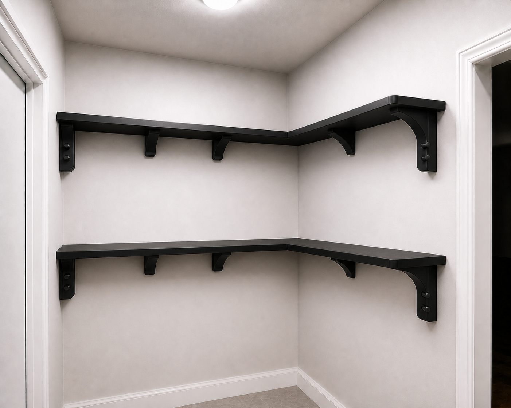

# Story Corner R9 — Palatine Moderne compact shelf

R9 captures the simpler shelf direction selected after R8: a restrained
Roman/Art-Deco, two-level black PETG L shelf with only two shortened feature
columns per level. The design language is named **Palatine Moderne**.
The far-left and far-right columns carry candidate cable sockets; intermediate
supports are compact and smooth; the inside corner has no visible column pair.



The image is an artist rendering, not proof of geometry, fit, framing, or load.
Its source prompt and hash are stored beside the image. `config.json` and
`design_math.py` are the exact authority for the current topology.

## Selected visual and practical layout

Per shelf level:

- **Far-left outer endpoint:** one shortened feature column with a candidate
  two-position cable rail.
- **Through-run interior:** three compact, ordinary-looking supports.
- **Inside corner:** two independently anchored but concealed support halves,
  one on each wall, joined beneath the shelf and hidden by one trim piece.
- **Return-run interior:** one compact support.
- **Far-right outer endpoint:** one shortened, handed feature column with a
  candidate two-position cable rail facing inward.

That retains every second R8 station: 8 structural stations per level with 6
visible supports—2 shortened bookends plus 4 compact supports. The two corner
halves remain structural candidates even though they are visually hidden. R9
does not delete the corner load path merely because the rendering looks clean.

Across both levels, the scaffold therefore calls for 4 outer bookend columns,
8 compact supports, and 4 concealed corner halves. Cable hardware is limited
to the 4 bookends: 2 sockets each, 8 sockets total. No peg or rail is allowed
on a compact support or at the inside corner.

The compact stations are approximately 14.59 inches apart on the long run and
14.16 inches apart on the return. The newly accepted wall measurements do not
silently respan this qualification scaffold or change its visible support
concept. Because a printed cassette seam now falls
between each pair of supports, this reduced count is inseparable from a
continuous segmented rear ledger and a staggered front-beam/fascia splice. The
ledger and splice are required qualification candidates, not optional trim and
not yet credited structure. At three metal screws per support candidate, the
visible/hidden supports alone imply 24 screws per level and 48 total; the
separate ledger fastener schedule remains unresolved.

All station centers in this scaffold are **run-local qualification
coordinates**, never drilling coordinates. The 5-foot/through run measures
from the far-left outer end toward the inside corner. The 3-foot/return run
measures from the inside corner toward the far-right outer end. R8's prior
global origins are deliberately not inherited; the field worksheet must
establish the real corner, trim, and framing datums before installed CAD is
authored.

## Shorter support proportions

- Shelf cassette thickness: **30.0 mm / 1.18 in**.
- Wall-hugging screw strap: **160.0 mm / 6.30 in** total drop beneath the
  shelf underside. This thin strip preserves a candidate three-screw lever arm
  but stays close to the wall.
- Outer bookend visible body: **120.65 mm / 4.75 in** below the underside.
- Compact visible corbel: **76.2 mm / 3.0 in** below the underside.

At proposed shelf-top elevations of 68 and 84 inches, the open shelf-to-shelf
height is about 14.82 inches. Directly beneath an outer bookend, about 10.07
inches remains above the lower shelf; beneath a compact corbel, about 11.82
inches remains. The thin wall strap extends lower but does not project through
the usable depth like the old full arch.

These dimensions are visual/qualification candidates, not credited structural
capacity. A 3-inch compact corbel has not been proven equivalent to the R8
160-mm D-frame.

## Corner and endpoint engineering boundary

The clean corner is not an unsupported printed L. The intended study uses two
A1-mini-printable hidden halves, each fastened independently into verified
framing on its own wall, plus an under-shelf shear key and cosmetic cover.
Corner angle, wall bow, framing, driver access, and the cassette intersection
are still unmeasured and unauthored.

R8 prohibited cable rails at terminal supports. R9 deliberately studies
handed endpoint rails, so both remain candidate-only until the doorway, trim,
snag, cable-loop, and removal-service envelopes are measured and tested.

The qualification geometry now includes distinct through-run and return-run
outer bookends. Each preserves the smooth support core and adds a fused,
two-socket receiver as positive PETG material; neither receiver is a removable
rail. A separate two-socket rail coupon, flush blank, and three-cable
comb/hook qualify the shared 0.4-mm-per-face, 8-mm gravity-seat interface
before either integrated bookend is printed. Both endpoint candidates remain
zero-rated and may not be wall-mounted until field clearance and physical
tests pass.

## Current field measurements and fit boundary

- Ceiling: approximately **96 in**.
- Top of outlet faceplate: approximately **53.5 in**.
- Proposed shelf tops: **68 in** and **84 in**.
- Through/long clear wall length: **61.25 in at both 68 in and 84 in**.
- Return/short clear wall length: **36.75 in at both 68 in and 84 in**. This is
  the conservative working value read from the supplied photos.

The existing R8-derived qualification scaffold remains 1514.475 mm
(59.625 in) on the through run and 751.275 mm (29.578 in) on the return run.
Against the accepted clear wall lengths, that leaves **41.275 mm / 1.625 in**
and **182.175 mm / 7.172 in**, respectively, as total unallocated clear-length
reserve. Those values only prove that the unchanged qualification scaffold is
shorter than the measured wall envelope. They are not endpoint offsets, trim
allowances, shelf cut lengths, corner compensation, or drilling coordinates.
Allocation still depends on the exact corner, wall bow, trim, and service
envelopes.

### Measured end-product spacing candidate

The immutable 5+3 qualification scaffold above is not the final measured
station map. `field_layout.py` applies the accepted wall lengths to the same
maximum-pitch ceilings and derives the minimum evenly spaced end-product
candidate:

- **61.25 in through/outlet wall:** 6 supports at **304.75 mm / 11.998 in**
  pitch, centered 0.630, 12.628, 24.626, 36.624, 48.622, and 60.620 inches
  from the far-left wall end.
- **36.75 in return wall:** 4 supports at **300.483 mm / 11.830 in** pitch,
  centered 0.630, 12.460, 24.290, and 36.120 inches from the inside corner.

That gives both walls one approximately 12-inch structural rhythm. Only the
far-left and far-right pieces are feature bookends; every visible middle piece
is the short compact form, and the two corner halves stay concealed. Per level
this is 10 structural support pieces, 8 visible and 2 hidden. Each support
candidate carries three authored fastener bores.

The first execution phase is deliberately narrower: **only the lower shelf at
68 inches on the 61.25-inch outlet wall**. Its six centers are exact design
candidates, not released drilling coordinates. The 84-inch shelf and the
36.75-inch return remain deferred until the lower through-wall shelf passes.

Still required before installed CAD stationing:

1. Horizontal distance from the through-run far-left datum to the outlet
   centerline.
2. Exact inside-corner angle and wall bow.
3. Stud or blocking locations and wall-substrate thickness.
4. Door-trim/service clearance and intended stored contents/load.

## What is ready to print first

The current versioned, neutral qualification bundle is
[`generated/qualification_v5`](generated/qualification_v5). It contains the
two self-contained corrected Stage-0 controls plus 17
individual model-only 3MF files, matching deterministic STLs, one off-plate
catalog 3MF, a generated README, validation evidence, and a hash manifest. The
catalog is **not** an A1-mini plate. Open individual files at 100% scale.

`generated/qualification_v1`, `generated/qualification_v2`, and
`generated/qualification_v3` are superseded history. V4 binds the accepted
wall measurements, exact user-supplied PETG identity, conservative first-print
process controls, and operator kickoff. Use only the v5 directory linked above.

Use the handoff guides in this order:

1. [`docs/MEASUREMENT_WORKSHEET.md`](docs/MEASUREMENT_WORKSHEET.md) — record
   exact field, electrical, framing, hardware, material, and load inputs.
2. [`docs/PRINTER_KICKOFF.md`](docs/PRINTER_KICKOFF.md) — exact material,
   Bambu Studio setup, Preview gates, and the human/operator handoff.
3. [`docs/PRINT_FIRST.md`](docs/PRINT_FIRST.md) — R8 clearance Gate 0, R9
   joint coupons, compact support, nominal-corner fixture, cable interface,
   then the two handed integrated bookends.
4. [`docs/TEST_PROTOCOL.md`](docs/TEST_PROTOCOL.md) — inspect and record every
   fit, flatness, service, and failure gate.
5. [`docs/ASSEMBLY.md`](docs/ASSEMBLY.md) — tabletop coupon and service
   procedures only; it does not authorize wall assembly.
6. [`docs/MATERIALS_AND_HARDWARE.md`](docs/MATERIALS_AND_HARDWARE.md) — exact
   first-shelf quantities, selected GRK/washer candidate, compatibility math,
   and the continuous-blocking stop.
7. [`docs/DESIGN_LANGUAGE.md`](docs/DESIGN_LANGUAGE.md) — the exact Palatine
   Moderne hierarchy and the no-weakened-structure ornament rules.

All 17 saved R9 articles are classified Support Off in software and fit the
A1 mini with the configured 5-mm brim, 0.1-mm brim-object gap, and 2-mm extra
edge reserve. Bambu Studio Preview review is still mandatory before every
print.

The qualification-v5 package still emits no G-code, wall bore, approved
fastener schedule, installed release, or load rating. Separate development of
the actual shelf architecture now publishes the versioned
[`generated/one_bay_prototype_v3`](generated/one_bay_prototype_v3) package. It
contains the two handed supports, rear ledger, front beam, and full-depth
three-web cassette that assemble into one exact 160 mm tabletop bay. Each
support includes three printed 7.0 mm round-envelope diamond bores at 16, 80,
and 144 mm below the shelf underside, plus flat-face room for a washer up to
20 mm OD. Adjacent holes are 64 mm apart. The support arch carries an additive
stepped Roman keystone and the front beam carries an additive stepped Art-Deco
center relief; neither decoration removes structural-core material. The holes
print with the part; do not drill or ream PETG afterward.

Those bores are hardware candidates, not wall-install authorization. The
selected fixture candidate is GRK RSS Climatek 1/4 in x 3-1/2 in, T25, part
90306, with one 1/4 in USS Type A steel washer per screw. The first lower wall
uses 18 installed screws/washers and the buy quantity is 24 of each. The exact
wall thickness, framing/blocking map,
electrical-clearance check, and proof-load protocol remain unresolved. The
preferred primary load path is metal structural screws into verified framing
or continuous blocking. A hollow-wall anchor may be considered only after one
exact product and the actual substrate are bound and tested; generic drywall
anchors are not silently credited.

`FROZEN_BASELINES.json` pins the complete R6, R7, and R8 development trees so
this new direction cannot silently rewrite previously audited evidence.

The current qualification sequence stops after standalone joint, support,
nominal-corner, cable-interface, and integrated-bookend tabletop articles. The
one-bay source now authors and software-validates the missing
member/support/cassette interfaces and mounting-bore pattern. The next physical
gate is that exact unloaded one-bay, followed by a framed-wall hardware
fixture. Only then may the lower 61.25-inch shelf set be emitted for proof,
creep, recovery, and destructive tests against a declared target load.

Run the current scaffold checks from the repository root:

```bash
PYTHONDONTWRITEBYTECODE=1 .venv/bin/python -m unittest discover \
  -s development/r9/tests -p 'test_*.py' -v
```
