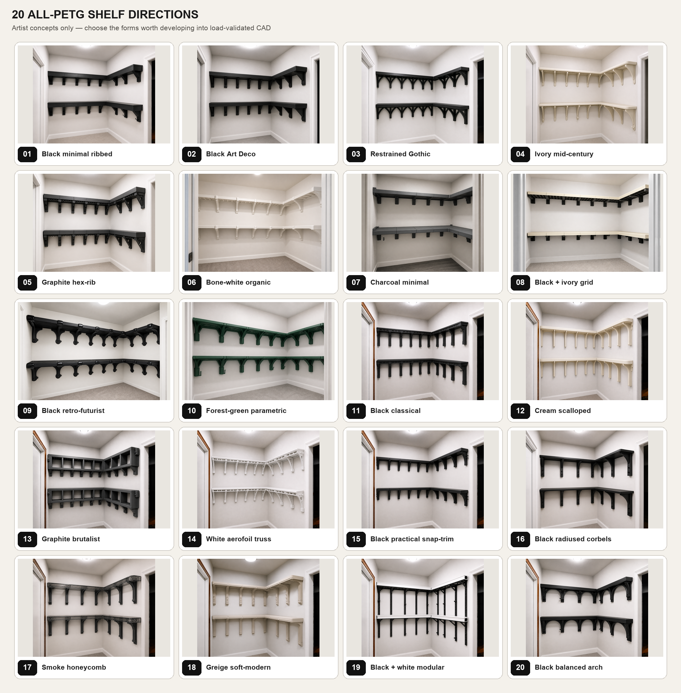

# Simplified all-PETG shelf concepts

These are artist renderings for choosing a design direction. Every shelf deck, cassette, rib, corbel, fascia, support, trim piece, and cable peg is depicted as 3D-printed PETG. No concept uses a wood or metal shelf structure. PLA could be evaluated later as an alternate printed material, but it is not mixed into these renderings.

They are not CAD, a bill of materials, or load evidence. Exact bay counts, part segmentation, wall attachment, creep, and safe working load must be resolved after a direction is selected. The wall itself will still require an independently qualified attachment method; the images intentionally do not invent visible metal hardware or unsupported floating shelves.

## Concepts

1. [Black minimal ribbed](artist_renderings/01_black_minimal_ribbed_petg.png) — thick modular cassettes, plain haunched supports, discreet pegs.
2. [Black Art Deco](artist_renderings/02_black_art_deco_petg.png) — stepped fascia and restrained geometric support details.
3. [Restrained Gothic](artist_renderings/03_black_restrained_gothic_petg.png) — clean pointed-arch trusses without the earlier ornament overload.
4. [Ivory mid-century](artist_renderings/04_ivory_midcentury_petg.png) — soft radii, warm light PETG, simple integrated pegs.
5. [Graphite hex-rib](artist_renderings/05_graphite_hex_rib_petg.png) — exposed honeycomb fascia and perforated structural corbels.
6. [Bone-white organic](artist_renderings/06_bone_white_organic_petg.png) — quiet rounded ribs in a near-wall color.
7. [Charcoal minimal](artist_renderings/07_charcoal_japanese_minimal_petg.png) — broad solid cassettes and the least visual clutter.
8. [Black + ivory grid](artist_renderings/08_black_ivory_modular_grid_petg.png) — light shelves over a black printed grid frame.
9. [Black retro-futurist](artist_renderings/09_black_retro_futurist_petg.png) — glossy rounded modules and compact curved supports.
10. [Forest-green parametric](artist_renderings/10_forest_green_parametric_petg.png) — branching printed ribs with a strong color statement.
11. [Black classical](artist_renderings/11_black_classical_arcade_petg.png) — restrained classical rhythm and squared piers.
12. [Cream scalloped](artist_renderings/12_cream_contemporary_scalloped_petg.png) — pale PETG and soft repeated curves.
13. [Graphite brutalist](artist_renderings/13_graphite_brutalist_petg.png) — deep box-rib modules with a heavier architectural presence.
14. [White aerofoil truss](artist_renderings/14_white_aerofoil_truss_petg.png) — visibly lightweight curved ribs and open fascia cells.
15. [Black practical snap-trim](artist_renderings/15_black_practical_snap_trim_petg.png) — plain structural cassettes with limited decorative covers.
16. [Black radiused corbels](artist_renderings/16_black_radiused_corbels_petg.png) — broad, calm corbels and clearly visible cable pegs.
17. [Smoke honeycomb](artist_renderings/17_smoke_honeycomb_petg.png) — translucent PETG fascia revealing the internal cellular structure.
18. [Greige soft-modern](artist_renderings/18_greige_soft_modern_petg.png) — rounded domestic styling and fluted pier supports.
19. [Black + white modular](artist_renderings/19_black_white_modular_petg.png) — white cassette shells on black printed X-bracing.
20. [Black balanced arch](artist_renderings/20_black_balanced_arch_petg.png) — a simpler version of the architectural-arch idea.

Exact generation prompts are preserved in:

- [prompts 01–05](artist_renderings/prompts_01_05.md)
- [prompts 06–10](artist_renderings/prompts_06_10.md)
- [prompts 11–15](artist_renderings/prompts_11_15.md)
- [prompts 16–20](artist_renderings/prompts_16_20.md)

The comparison sheet is reproducible with [build_contact_sheet.py](build_contact_sheet.py).

## Selected refinement

The selected source is concept 16. Its active refinement is [16B: compact structural corbels with modular cable rails](SELECTED_DIRECTION_16B.md). It retains the simple individual-bracket appearance while adding replaceable single-cable, cable-comb, coil-hook, and blank-cap modules to safe interior downward supports. The earlier 20B study is superseded.
