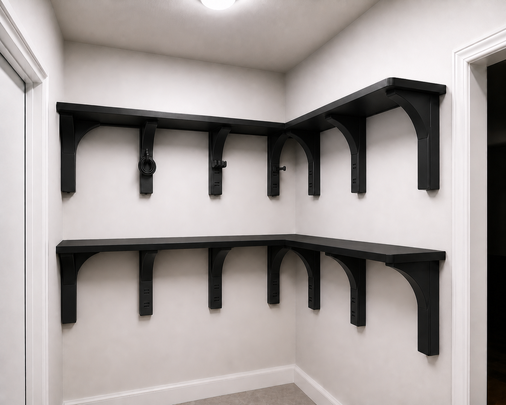

# Selected direction 16B — compact structural corbels with modular cable rails

This supersedes the mistaken concept-20 refinement. The user-selected source image is concept 16.

## Structural intent

- Keep the simple bracket-by-bracket appearance of concept 16.
- Each support uses a broad wall spine and one compact curved PETG gusset that joins continuously into the shelf cassette's underside rib.
- Curves stay inside individual bracket footprints; there is no decorative arcade spanning between supports.
- An arch shape receives no load credit by appearance alone. Exact CAD, wall attachment, PETG creep analysis, and physical load testing must establish capacity.

## Cable organization

Selected safe interior wall spines receive a common three-socket accessory interface. The removable PETG modules are:

1. a short single-cable peg;
2. a three-prong cable-comb peg;
3. a broad J-hook for one coiled cable bundle; and
4. a flush blank cap.

Doorway-adjacent supports and the two supports nearest the inside L-corner stay smooth and free of cable accessories. Most sockets remain capped so the closet does not become visually busy. Cable accessories are for lightweight cable organization only until separately qualified.

