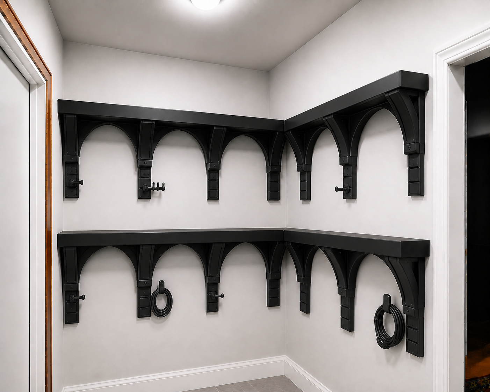

# Superseded study 20B — structural arches with modular cable rails

This was based on the wrong concept. The user subsequently identified concept 16 as the intended source. The active direction is [16B](SELECTED_DIRECTION_16B.md).

This was a refinement of concept 20. It remains historical artist-concept material only.

## Shelf structure

- The arch is a thick structural rib, not decorative trim.
- Each arch must join continuously into three real load-path elements: the shelf cassette's deep underside box rib, the rear wall spine, and the adjacent arch/rib web.
- The visible shelf, cassette, rib, arch, spine, fascia, and cable accessories remain printed PETG.
- The render does not establish a load rating. The arch receives strength credit only after exact geometry, creep analysis, wall-attachment design, and physical load testing.

## Modular cable system

Each safe downward support becomes a vertical accessory rail with three keyed sockets. Sockets accept replaceable external PETG modules:

1. a short single-cable peg;
2. a three-channel cable-comb peg;
3. a broad J-hook for a neatly coiled cable bundle; or
4. a flush blank cap when nothing is needed.

The sockets should use one common keyed interface, include a positive removal feature, and prevent an accessory from rotating under cable weight. Rounded noses and short upturned retainers keep cables from slipping off.

## Placement rules

- Put rails on ordinary interior supports, not every support.
- Keep the inside L-corner and both doorway-adjacent supports free of pegs.
- Keep cable accessories removable before shelf service or disassembly.
- Pegs are for cables and lightweight organization only—not clothes, bags, tools, shelf loads, or user pull loads—until separately qualified.

This approach makes the space adaptable without forcing every support to carry permanent hooks or requiring a whole support to be reprinted when one peg breaks.
